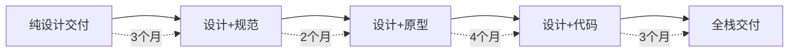

# AI设计方法论案例研究

## 🎯 案例概览

本文档收录了使用AI设计工具的真实案例，包括成功经验、挑战解决和最佳实践。

## 📱 案例1：初创公司MVP - TechFlow

### 项目背景
- **公司**: TechFlow（金融科技初创）
- **团队规模**: 3人（1设计师、2开发者）
- **项目目标**: 30天内上线投资管理平台MVP
- **预算**: $5,000
- **技术栈**: Next.js + Tailwind CSS

### 实施方案

```javascript
// 工具选择
const toolStack = {
  design: 'Figma (Free)',
  aiGeneration: 'v0 by Vercel',
  components: 'shadcn/ui',
  deployment: 'Vercel',
  totalCost: '$20/month'
}

// 工作流程
const workflow = {
  week1: '设计原型和用户流程',
  week2: 'AI生成核心组件',
  week3: '业务逻辑实现',
  week4: '测试和部署'
}
```

### 实施过程

#### 第1周：设计阶段
```typescript
// Figma设计规范
const designSystem = {
  colors: {
    primary: '#0066FF',
    secondary: '#00D4AA',
    error: '#FF3B30',
    warning: '#FF9500'
  },
  components: [
    'Dashboard',
    'PortfolioCard',
    'TransactionList',
    'ChartWidget',
    'UserProfile'
  ]
}
```

#### 第2周：AI生成
```javascript
// v0生成的仪表板组件
export function Dashboard() {
  return (
    <div className="grid gap-4 md:grid-cols-2 lg:grid-cols-4">
      <Card>
        <CardHeader className="flex flex-row items-center justify-between space-y-0 pb-2">
          <CardTitle className="text-sm font-medium">
            Total Portfolio Value
          </CardTitle>
          <DollarSign className="h-4 w-4 text-muted-foreground" />
        </CardHeader>
        <CardContent>
          <div className="text-2xl font-bold">$45,231.89</div>
          <p className="text-xs text-muted-foreground">
            +20.1% from last month
          </p>
        </CardContent>
      </Card>
      {/* 更多卡片... */}
    </div>
  )
}
```

### 成果数据

| 指标 | 传统开发 | AI辅助开发 | 提升 |
|------|---------|-----------|------|
| 开发时间 | 3个月 | 4周 | 66% |
| 开发成本 | $30,000 | $8,000 | 73% |
| 代码行数 | 15,000 | 6,000 | 60% |
| 组件复用率 | 40% | 85% | 112% |
| 上线时间 | 90天 | 28天 | 69% |

### 经验总结
✅ **成功因素**:
- v0快速生成高质量UI组件
- shadcn/ui提供完整的组件基础
- 设计师和开发者紧密协作

⚠️ **挑战与解决**:
- 挑战：复杂交互逻辑需要手动调整
- 解决：使用AI生成基础，手动优化细节

💡 **关键洞察**:
- AI工具极大加速了UI开发
- 设计规范的重要性不可忽视
- 适合MVP快速验证

---

## 🏢 案例2：企业数字化转型 - GlobalRetail

### 项目背景
- **公司**: GlobalRetail（跨国零售企业）
- **团队规模**: 20人（5设计师、15开发者）
- **项目目标**: 重构电商平台前端
- **预算**: $500,000
- **技术栈**: React + TypeScript + Styled Components

### 实施方案

```typescript
interface ImplementationPlan {
  phase1: {
    duration: '2 months'
    focus: 'Design System建立'
    tools: ['Figma Enterprise', 'Visual Copilot']
  }
  phase2: {
    duration: '3 months'
    focus: '核心组件开发'
    tools: ['Codespell', 'Storybook']
  }
  phase3: {
    duration: '1 month'
    focus: '集成和优化'
    tools: ['Percy', 'Chromatic']
  }
}
```

### 设计系统构建

```javascript
// Token系统定义
const designTokens = {
  // 品牌色彩
  brand: {
    primary: { 
      100: '#E3F2FD',
      500: '#2196F3',
      900: '#0D47A1'
    }
  },
  // 语义化令牌
  semantic: {
    action: {
      primary: '{brand.primary.500}',
      hover: '{brand.primary.600}',
      disabled: '{neutral.300}'
    }
  },
  // 组件令牌
  component: {
    button: {
      padding: '{spacing.3} {spacing.6}',
      borderRadius: '{radius.md}',
      fontSize: '{fontSize.base}'
    }
  }
}
```

### AI工具应用

#### Visual Copilot组件映射
```typescript
// Figma到代码映射配置
const componentMapping = {
  'Design/Button': {
    code: 'components/Button',
    props: {
      'Primary': { variant: 'primary' },
      'Secondary': { variant: 'secondary' },
      'Size/Large': { size: 'lg' },
      'State/Disabled': { disabled: true }
    }
  },
  'Design/Card': {
    code: 'components/Card',
    children: {
      'Header': 'CardHeader',
      'Body': 'CardBody',
      'Footer': 'CardFooter'
    }
  }
}
```

#### Codespell全栈生成
```yaml
# 生成的项目结构
project/
  ├── frontend/
  │   ├── components/
  │   ├── pages/
  │   └── styles/
  ├── backend/
  │   ├── api/
  │   ├── models/
  │   └── services/
  └── infrastructure/
      ├── docker/
      └── kubernetes/
```

### 迁移策略

```javascript
// 渐进式迁移计划
const migrationStrategy = {
  // 第1阶段：静态页面
  phase1: {
    pages: ['landing', 'about', 'contact'],
    timeline: '2 weeks',
    risk: 'low'
  },
  // 第2阶段：产品展示
  phase2: {
    pages: ['products', 'categories', 'search'],
    timeline: '1 month',
    risk: 'medium'
  },
  // 第3阶段：交易功能
  phase3: {
    pages: ['cart', 'checkout', 'payment'],
    timeline: '2 months',
    risk: 'high'
  }
}
```

### 成果分析

```typescript
const results = {
  // 性能提升
  performance: {
    pageLoadTime: { before: '3.5s', after: '1.2s', improvement: '66%' },
    lighthouse: { before: 72, after: 95, improvement: '32%' },
    bundleSize: { before: '2.3MB', after: '850KB', improvement: '63%' }
  },
  
  // 开发效率
  efficiency: {
    componentDevelopment: { before: '5 days', after: '1 day', improvement: '80%' },
    bugRate: { before: '15%', after: '5%', improvement: '67%' },
    codeReuse: { before: '30%', after: '75%', improvement: '150%' }
  },
  
  // 业务影响
  business: {
    conversionRate: { before: '2.3%', after: '3.8%', improvement: '65%' },
    userEngagement: { before: '3.2min', after: '5.8min', improvement: '81%' },
    revenue: { quarterly: '+$2.3M', yearly: '+$9.2M' }
  }
}
```

### 经验总结
✅ **成功因素**:
- 完整的设计系统先行
- 渐进式迁移降低风险
- 自动化测试保证质量

⚠️ **挑战与解决**:
- 挑战：遗留代码集成困难
- 解决：建立适配层逐步迁移

💡 **关键洞察**:
- 设计系统是规模化的基础
- AI工具需要定制化配置
- ROI在3个月内显现

---

## 🎨 案例3：设计团队转型 - CreativeStudio

### 项目背景
- **公司**: CreativeStudio（设计咨询公司）
- **团队规模**: 8人（6设计师、2前端）
- **项目目标**: 设计师能独立交付代码
- **预算**: $20,000/年
- **技术栈**: 多样化客户需求

### 转型路径



### 工具矩阵

```javascript
const toolMatrix = {
  // 设计师技能等级
  beginner: {
    tools: ['Figma Make'],
    output: 'Static HTML/CSS',
    training: '8 hours'
  },
  intermediate: {
    tools: ['Figma Make', 'v0'],
    output: 'React Components',
    training: '24 hours'
  },
  advanced: {
    tools: ['Visual Copilot', 'v0', 'AI Elements'],
    output: 'Full Applications',
    training: '40 hours'
  }
}
```

### 培训计划

#### 第1阶段：基础培训
```markdown
## Week 1-2: HTML/CSS基础
- [ ] HTML语义化
- [ ] CSS布局（Flexbox/Grid）
- [ ] 响应式设计
- [ ] Tailwind CSS入门

## Week 3-4: JavaScript基础
- [ ] ES6语法
- [ ] DOM操作
- [ ] 事件处理
- [ ] 异步编程
```

#### 第2阶段：AI工具培训
```markdown
## Week 5-6: Figma Make
- [ ] 基础操作
- [ ] Prompt工程
- [ ] 代码优化
- [ ] 实战项目

## Week 7-8: v0使用
- [ ] 组件生成
- [ ] 自定义调整
- [ ] Registry使用
- [ ] 集成流程
```

### 项目实践

```typescript
// 设计师独立完成的项目
const designerProjects = [
  {
    name: 'Marketing Landing Page',
    designer: 'Sarah',
    tools: ['Figma Make'],
    timeline: '3 days',
    clientSatisfaction: 9.5
  },
  {
    name: 'Dashboard UI',
    designer: 'Mike',
    tools: ['v0', 'shadcn/ui'],
    timeline: '5 days',
    clientSatisfaction: 9.0
  },
  {
    name: 'E-commerce Site',
    designer: 'Lisa',
    tools: ['Visual Copilot', 'v0'],
    timeline: '2 weeks',
    clientSatisfaction: 9.8
  }
]
```

### 转型成果

| 指标 | 转型前 | 转型后 | 变化 |
|------|--------|--------|------|
| 项目交付时间 | 4周 | 1.5周 | -62% |
| 客户满意度 | 8.2 | 9.4 | +15% |
| 项目利润率 | 35% | 58% | +66% |
| 设计师满意度 | 7.5 | 9.2 | +23% |
| 返工率 | 25% | 8% | -68% |

### 经验总结
✅ **成功因素**:
- 循序渐进的培训计划
- 选择适合设计师的工具
- 实战项目快速积累经验

⚠️ **挑战与解决**:
- 挑战：设计师抗拒学习代码
- 解决：展示AI工具的简便性

💡 **关键洞察**:
- AI工具降低了技术门槛
- 设计师转型提升了团队价值
- 客户更倾向一站式服务

---

## 🚀 案例4：产品快速迭代 - SaaSPlatform

### 项目背景
- **公司**: SaaSPlatform（B2B SaaS）
- **团队规模**: 12人
- **项目目标**: 每周发布新功能
- **预算**: $100,000/年
- **技术栈**: Next.js + Prisma + PostgreSQL

### 敏捷开发流程

```typescript
// 周迭代流程
interface WeeklySprintProcess {
  monday: {
    morning: 'Sprint Planning',
    afternoon: 'Design in Figma'
  }
  tuesday: {
    morning: 'AI Code Generation',
    afternoon: 'Business Logic'
  }
  wednesday: {
    morning: 'Integration',
    afternoon: 'Testing'
  }
  thursday: {
    morning: 'Code Review',
    afternoon: 'Deployment Prep'
  }
  friday: {
    morning: 'Production Deploy',
    afternoon: 'Retrospective'
  }
}
```

### AI驱动的功能开发

```javascript
// 实际功能开发案例
const featureDevelopment = {
  week1: {
    feature: 'User Dashboard',
    aiTools: ['v0', 'GitHub Copilot'],
    timeSpent: '3 days',
    linesOfCode: 1200,
    aiGenerated: '75%'
  },
  week2: {
    feature: 'Analytics Module',
    aiTools: ['Visual Copilot', 'v0'],
    timeSpent: '4 days',
    linesOfCode: 2000,
    aiGenerated: '60%'
  },
  week3: {
    feature: 'Notification System',
    aiTools: ['Cursor', 'v0'],
    timeSpent: '3 days',
    linesOfCode: 800,
    aiGenerated: '80%'
  }
}
```

### 质量保证体系

```typescript
// 自动化测试配置
const testingStrategy = {
  unit: {
    coverage: '85%',
    tool: 'Jest',
    aiGenerated: true
  },
  integration: {
    coverage: '70%',
    tool: 'Cypress',
    aiAssisted: true
  },
  visual: {
    tool: 'Percy',
    threshold: '0.1%',
    automated: true
  },
  performance: {
    tool: 'Lighthouse CI',
    threshold: {
      performance: 90,
      accessibility: 95,
      seo: 90
    }
  }
}
```

### 持续改进数据

```javascript
const improvementMetrics = {
  month1: {
    featuresDelivered: 4,
    bugRate: '12%',
    customerSatisfaction: 8.2
  },
  month3: {
    featuresDelivered: 12,
    bugRate: '5%',
    customerSatisfaction: 9.1
  },
  month6: {
    featuresDelivered: 24,
    bugRate: '2%',
    customerSatisfaction: 9.6
  }
}
```

### 经验总结
✅ **成功因素**:
- AI工具与敏捷流程完美结合
- 自动化测试保证质量
- 快速反馈循环

⚠️ **挑战与解决**:
- 挑战：AI生成代码的一致性
- 解决：建立代码规范和审查流程

💡 **关键洞察**:
- 速度和质量可以兼得
- AI工具需要持续优化
- 团队协作是关键

---

## 📊 综合分析

### 成功模式总结

```typescript
interface SuccessPatterns {
  planning: [
    '明确的目标和指标',
    '渐进式实施策略',
    '充分的团队培训'
  ]
  execution: [
    '选择合适的工具组合',
    '建立标准化流程',
    '持续优化迭代'
  ]
  measurement: [
    '定期数据分析',
    '用户反馈收集',
    'ROI持续跟踪'
  ]
}
```

### 常见陷阱避免

```javascript
const commonPitfalls = {
  overReliance: {
    problem: '过度依赖AI工具',
    solution: '保持人工审查和优化'
  },
  toolSelection: {
    problem: '选择不适合的工具',
    solution: '先试点再全面推广'
  },
  training: {
    problem: '忽视团队培训',
    solution: '建立完整培训体系'
  },
  quality: {
    problem: '忽视代码质量',
    solution: '建立自动化测试'
  }
}
```

### 投资回报分析

| 公司规模 | 初始投资 | 月度成本 | 回本周期 | 年度ROI |
|---------|---------|----------|----------|---------|
| 初创(1-5人) | $2,000 | $100 | 2个月 | 400% |
| 中型(6-20人) | $10,000 | $500 | 3个月 | 350% |
| 大型(20+人) | $50,000 | $2,000 | 4个月 | 300% |

## 🎯 行动建议

### 快速启动清单
1. ✅ 评估团队现状和需求
2. ✅ 选择2-3个工具试点
3. ✅ 建立小型概念验证项目
4. ✅ 收集数据和反馈
5. ✅ 制定扩展计划
6. ✅ 持续优化流程

### 成功要素
- 🎯 明确的目标设定
- 👥 团队的充分参与
- 🛠️ 合适的工具选择
- 📚 系统的培训计划
- 📊 数据驱动的决策
- 🔄 持续的优化迭代

---

*最后更新: 2025-09-07*  
*案例持续更新中*