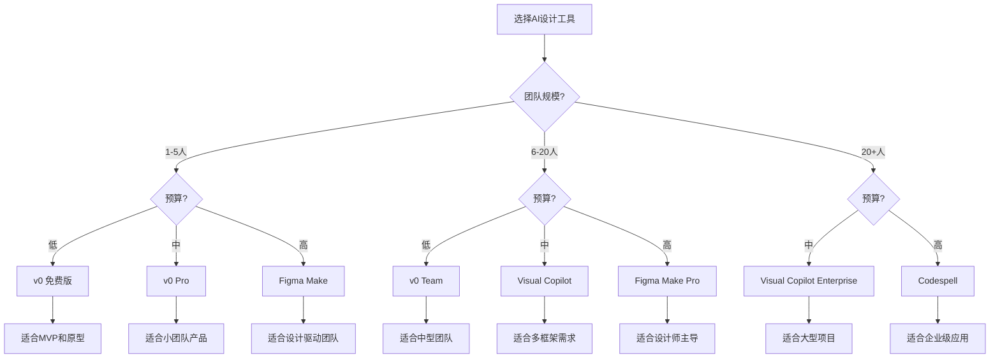

# AI设计工具详细对比分析

## 🎯 综合对比矩阵

### 主流工具完整对比

| 功能特性 | Figma Make | v0 by Vercel | Visual Copilot | Anima | Codespell | tldraw | Excalidraw |
|---------|------------|--------------|----------------|-------|-----------|--------|------------|
| **AI模型** | Claude 3.7 | 专有模型 | LLM增强 | 专有模型 | 混合模型 | GPT-4 Vision | GPT-4 Vision |
| **输入方式** | 文本描述 | 文本/图片/Figma | Figma设计 | Figma设计 | Figma设计 | 手绘/草图 | 线框图 |
| **框架支持** | Web通用 | React/Next优先 | 全框架 | 主流框架 | 全栈 | React为主 | 多框架 |
| **样式方案** | 灵活 | Tailwind | 多种 | CSS/Styled | 多种 | Tailwind | 灵活 |
| **响应式** | ✅ | ✅ | ✅ | ⚠️ | ✅ | ⚠️ | ⚠️ |
| **组件映射** | ⚠️ | ✅ | ✅ | ✅ | ✅ | ❌ | ❌ |
| **实时协作** | ✅ | ❌ | ❌ | ⚠️ | ❌ | ✅ | ✅ |
| **版本控制** | ✅ | ⚠️ | ⚠️ | ⚠️ | ✅ | ❌ | ⚠️ |
| **价格模式** | 订阅制 | 免费+Pro | 订阅制 | 订阅制 | 企业级 | 免费+Pro | 免费 |
| **学习曲线** | 低 | 低 | 中 | 中 | 高 | 低 | 低 |
| **代码质量** | 高 | 很高 | 高 | 中 | 很高 | 中 | 中 |

### 评分系统（满分5分）

```javascript
const toolRatings = {
  'Figma Make': {
    ease_of_use: 5,
    code_quality: 4,
    flexibility: 3,
    integration: 5,
    value_for_money: 4,
    overall: 4.2
  },
  'v0 by Vercel': {
    ease_of_use: 5,
    code_quality: 5,
    flexibility: 4,
    integration: 4,
    value_for_money: 5,
    overall: 4.6
  },
  'Visual Copilot': {
    ease_of_use: 3,
    code_quality: 4,
    flexibility: 5,
    integration: 4,
    value_for_money: 3,
    overall: 3.8
  },
  'Anima': {
    ease_of_use: 3,
    code_quality: 3,
    flexibility: 3,
    integration: 3,
    value_for_money: 3,
    overall: 3.0
  },
  'Codespell': {
    ease_of_use: 2,
    code_quality: 5,
    flexibility: 5,
    integration: 5,
    value_for_money: 3,
    overall: 4.0
  }
}
```

## 💰 成本分析

### 定价模型对比

| 工具 | 免费版 | 入门版 | 专业版 | 企业版 |
|------|--------|--------|---------|---------|
| **Figma Make** | ❌ | $12/月 | $45/月 | 定制 |
| **v0 by Vercel** | 10次/月 | $20/月 | $50/月 | 定制 |
| **Visual Copilot** | 试用 | $79/月 | $199/月 | 定制 |
| **Anima** | 有限功能 | $31/月 | $63/月 | 定制 |
| **Codespell** | ❌ | ❌ | $299/月 | 定制 |
| **tldraw** | ✅ | $10/月 | $25/月 | 定制 |
| **Excalidraw** | ✅ | ✅ | $7/月 | N/A |

### ROI计算器

```typescript
// ROI计算示例
function calculateROI(tool: string, teamSize: number) {
  const toolCosts = {
    'v0': 20 * teamSize,
    'visual-copilot': 79 * teamSize,
    'figma-make': 45 * teamSize
  }
  
  const timeSavings = {
    'v0': 0.7,        // 节省70%时间
    'visual-copilot': 0.6,
    'figma-make': 0.8
  }
  
  const averageDevCost = 5000 // 月薪
  const designToDevelopmentTime = 0.3 // 30%时间用于UI开发
  
  const monthlySaving = averageDevCost * designToDevelopmentTime * timeSavings[tool] * teamSize
  const monthlyCost = toolCosts[tool]
  
  return {
    monthlySaving,
    monthlyCost,
    netSaving: monthlySaving - monthlyCost,
    roi: ((monthlySaving - monthlyCost) / monthlyCost * 100).toFixed(2) + '%'
  }
}
```

## 🎯 使用场景匹配

### 场景1：快速原型开发
**最佳选择**: Figma Make + tldraw
```markdown
优势：
- 快速从想法到原型
- 支持手绘和描述输入
- 成本低，上手快

适用于：
- 初创公司MVP
- 概念验证
- 用户测试原型
```

### 场景2：设计系统维护
**最佳选择**: v0 + Visual Copilot
```markdown
优势：
- 完整的组件映射
- 高质量代码输出
- Registry系统支持

适用于：
- 中大型团队
- 成熟产品迭代
- 组件库维护
```

### 场景3：企业级应用
**最佳选择**: Codespell + Visual Copilot
```markdown
优势：
- 全栈代码生成
- 企业级质量保证
- 完整的SDLC集成

适用于：
- 大型企业项目
- 复杂业务系统
- 多团队协作
```

### 场景4：设计师主导
**最佳选择**: Figma Make + Anima
```markdown
优势：
- 设计师友好界面
- 无需编码知识
- 直接从设计工具操作

适用于：
- 设计团队主导项目
- 营销页面制作
- 快速迭代需求
```

## 🔧 技术栈兼容性

### 前端框架支持

```javascript
const frameworkSupport = {
  'React': ['v0', 'Visual Copilot', 'Figma Make', 'Anima', 'Codespell', 'tldraw'],
  'Vue': ['Visual Copilot', 'Anima', 'Codespell'],
  'Angular': ['Visual Copilot', 'Codespell'],
  'Svelte': ['Visual Copilot', 'Codespell'],
  'Next.js': ['v0', 'Visual Copilot', 'Figma Make', 'Codespell'],
  'Nuxt': ['Visual Copilot', 'Codespell'],
  'HTML/CSS': ['All']
}
```

### 样式方案支持

```javascript
const stylingSupport = {
  'Tailwind CSS': ['v0', 'Visual Copilot', 'Figma Make', 'tldraw'],
  'CSS Modules': ['Visual Copilot', 'Codespell'],
  'Styled Components': ['Visual Copilot', 'Anima', 'Codespell'],
  'Emotion': ['Visual Copilot', 'Codespell'],
  'Sass/SCSS': ['Visual Copilot', 'Anima', 'Codespell'],
  'CSS-in-JS': ['Visual Copilot', 'Codespell'],
  'Vanilla CSS': ['All']
}
```

## 📊 性能基准测试

### 转换速度对比

```typescript
interface BenchmarkResult {
  tool: string
  simpleComponent: number  // 秒
  complexPage: number      // 秒
  fullApplication: number  // 分钟
}

const benchmarks: BenchmarkResult[] = [
  { tool: 'v0', simpleComponent: 3, complexPage: 8, fullApplication: 5 },
  { tool: 'Figma Make', simpleComponent: 5, complexPage: 12, fullApplication: 8 },
  { tool: 'Visual Copilot', simpleComponent: 4, complexPage: 10, fullApplication: 7 },
  { tool: 'Anima', simpleComponent: 6, complexPage: 15, fullApplication: 12 },
  { tool: 'Codespell', simpleComponent: 8, complexPage: 20, fullApplication: 15 }
]
```

### 代码质量评估

```javascript
const codeQualityMetrics = {
  'v0': {
    readability: 95,
    maintainability: 90,
    performance: 85,
    accessibility: 90,
    seo: 80
  },
  'Visual Copilot': {
    readability: 85,
    maintainability: 80,
    performance: 80,
    accessibility: 75,
    seo: 70
  },
  'Figma Make': {
    readability: 80,
    maintainability: 75,
    performance: 75,
    accessibility: 80,
    seo: 75
  }
}
```

## 🚀 迁移指南

### 从传统开发迁移

```markdown
## 第1步：评估现状
- [ ] 分析当前设计到开发流程
- [ ] 识别瓶颈和痛点
- [ ] 计算当前成本

## 第2步：选择工具
- [ ] 根据团队规模选择
- [ ] 考虑技术栈兼容性
- [ ] 评估学习成本

## 第3步：试点项目
- [ ] 选择低风险项目
- [ ] 建立成功指标
- [ ] 收集反馈

## 第4步：逐步推广
- [ ] 培训团队
- [ ] 建立最佳实践
- [ ] 扩展到更多项目
```

### 工具间迁移

```javascript
// 迁移脚本示例
async function migrateFromAnimaToV0() {
  // 1. 导出Anima组件
  const animaComponents = await exportFromAnima()
  
  // 2. 转换为v0格式
  const v0Components = animaComponents.map(comp => ({
    name: comp.name,
    code: convertToV0Format(comp.code),
    props: mapPropsToV0(comp.props)
  }))
  
  // 3. 创建v0 Registry
  await createV0Registry(v0Components)
  
  // 4. 验证迁移
  await validateMigration(v0Components)
}
```

## 💡 决策树



## 🔮 未来趋势预测

### 2025年趋势
1. **多模态输入**: 语音、手势、AR/VR输入
2. **实时协作**: 设计和代码同步编辑
3. **智能优化**: AI自动性能和可访问性优化
4. **跨平台统一**: 一次设计，全平台部署

### 工具演进方向
- 更强的上下文理解能力
- 更精确的设计意图识别
- 更智能的代码优化
- 更完善的测试生成

---

*最后更新: 2025-09-07*  
*数据来源: 官方文档、用户评测、实际测试*