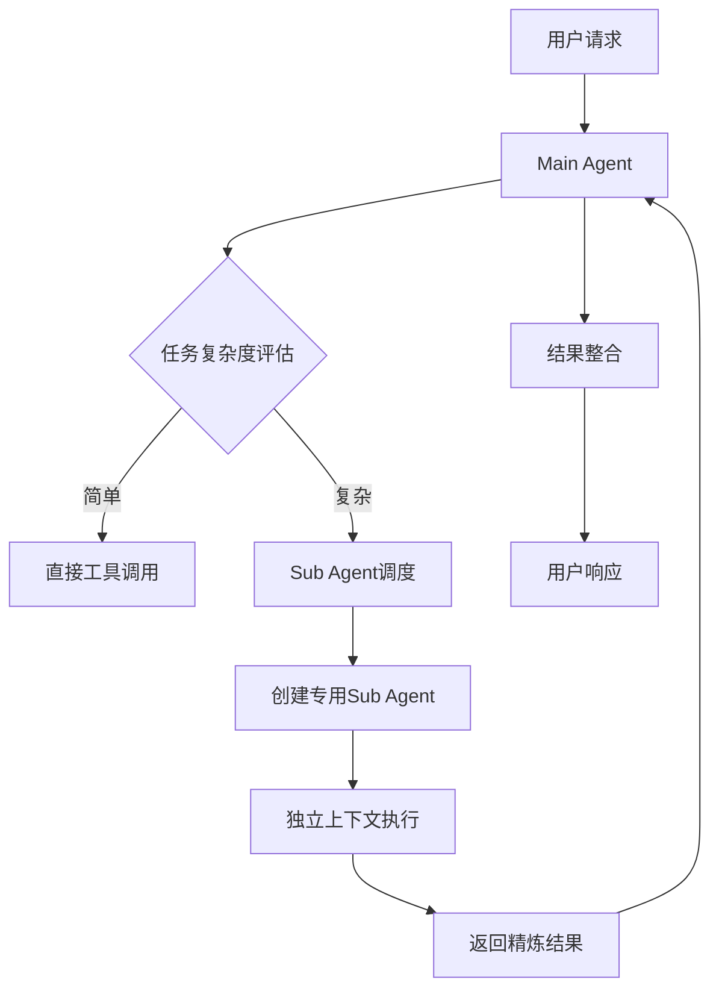

# Multi-Agent协作模式

> 基于Claude Code实践的多Agent协作架构设计

## 1. Multi-Agent模式概述

### 1.1 设计理念
Multi-Agent模式通过将复杂任务分解给专门的Agent处理，实现：
- **任务隔离**：每个Agent专注特定领域
- **上下文优化**：避免主对话被"脏数据"污染
- **并行处理**：多Agent同时执行，提升效率
- **专业化**：不同Agent配置专门的工具和提示词

### 1.2 Claude Code的Multi-Agent实现
```
Main Agent (用户直接交互)
    ├── General Purpose Agent (通用搜索和分析)
    ├── Code Search Agent (代码库搜索)
    ├── Documentation Agent (文档生成)
    └── Testing Agent (测试执行)
```

## 2. Main-Sub Agent架构

### 2.1 架构原理


### 2.2 核心组件设计

#### Main Agent Controller
```python
class MainAgentController:
    def __init__(self):
        self.sub_agents = SubAgentPool()
        self.task_router = TaskRouter()
        self.result_aggregator = ResultAggregator()
    
    async def handle_request(self, request: UserRequest) -> Response:
        # 1. 分析任务复杂度
        complexity = self.assess_task_complexity(request)
        
        if complexity == TaskComplexity.SIMPLE:
            return await self.execute_directly(request)
        else:
            return await self.delegate_to_sub_agents(request)
    
    async def delegate_to_sub_agents(self, request: UserRequest) -> Response:
        # 2. 任务分解
        sub_tasks = self.decompose_task(request)
        
        # 3. 并行执行
        results = await asyncio.gather(*[
            self.execute_sub_task(task) for task in sub_tasks
        ])
        
        # 4. 结果聚合
        return self.result_aggregator.merge_results(results)
```

#### Sub Agent Factory
```python
class SubAgentFactory:
    def __init__(self):
        self.agent_templates = {
            'general-purpose': GeneralPurposeAgentTemplate(),
            'code-search': CodeSearchAgentTemplate(),
            'documentation': DocumentationAgentTemplate(),
            'testing': TestingAgentTemplate()
        }
    
    def create_agent(self, agent_type: str, context: TaskContext) -> SubAgent:
        template = self.agent_templates[agent_type]
        
        return SubAgent(
            agent_id=generate_unique_id(),
            agent_type=agent_type,
            system_prompt=template.get_system_prompt(),
            tools=template.get_available_tools(),
            context=context.create_isolated_context(),
            max_iterations=template.max_iterations
        )
```

## 3. Agent类型与专业化

### 3.1 General Purpose Agent
```yaml
用途: 处理通用任务和复杂查询
工具集: [Read, Write, Edit, Bash, Grep, Glob, WebFetch, WebSearch]
提示词特色:
  - 强调全面分析
  - 支持多轮推理
  - 结果综合能力
适用场景:
  - 代码重构分析
  - 技术方案调研  
  - 问题诊断排查
```

### 3.2 Code Search Agent
```yaml
用途: 专门处理代码库搜索和分析
工具集: [Grep, Glob, Read, AST Parser]
提示词特色:
  - 代码模式识别
  - 语法树理解
  - 依赖关系分析
优化策略:
  - 智能搜索路径规划
  - 结果相关性排序
  - 上下文最小化
适用场景:
  - 函数定义查找
  - 依赖关系追踪
  - 代码使用分析
```

### 3.3 Documentation Agent
```yaml
用途: 生成和维护技术文档
工具集: [Read, Write, WebFetch, Template Engine]
提示词特色:
  - 文档结构化思维
  - 用户视角描述
  - 示例代码生成
质量保证:
  - 内容准确性验证
  - 格式规范检查
  - 更新时效性管理
适用场景:
  - API文档生成
  - 使用指南编写
  - 架构设计文档
```

### 3.4 Testing Agent
```yaml
用途: 执行测试和质量保证
工具集: [Bash, Read, Write, Test Framework]
提示词特色:
  - 测试用例设计思维
  - 边界条件考虑
  - 质量指标关注
执行策略:
  - 并行测试执行
  - 失败快速反馈
  - 覆盖率分析
适用场景:
  - 单元测试执行
  - 集成测试运行
  - 性能基准测试
```

## 4. 任务分发策略

### 4.1 复杂度评估算法
```python
class TaskComplexityAssessor:
    def __init__(self):
        self.complexity_model = ComplexityMLModel()
    
    def assess(self, task: Task) -> TaskComplexity:
        features = {
            'step_count': len(task.steps),
            'file_count': len(task.target_files),
            'dependency_depth': task.calculate_dependency_depth(),
            'estimated_tokens': task.estimate_token_usage(),
            'tool_diversity': len(set(task.required_tools)),
            'domain_expertise': task.get_domain_complexity()
        }
        
        return self.complexity_model.predict(features)

class TaskComplexity(Enum):
    SIMPLE = "simple"      # 直接执行
    MEDIUM = "medium"      # Main Agent处理
    COMPLEX = "complex"    # Single Sub Agent
    DISTRIBUTED = "distributed"  # Multiple Sub Agents
```

### 4.2 动态负载均衡
```python
class LoadBalancer:
    def __init__(self):
        self.agent_pool = {}
        self.load_metrics = LoadMetrics()
    
    def select_optimal_agent(self, agent_type: str) -> Optional[SubAgent]:
        available_agents = self.agent_pool.get(agent_type, [])
        
        if not available_agents:
            return None
        
        # 选择负载最低的Agent
        return min(available_agents, 
                  key=lambda agent: self.load_metrics.get_load(agent.id))
    
    def scale_agent_pool(self, agent_type: str, target_size: int):
        current_size = len(self.agent_pool.get(agent_type, []))
        
        if current_size < target_size:
            # 创建新的Agent实例
            for _ in range(target_size - current_size):
                agent = self.agent_factory.create_agent(agent_type)
                self.agent_pool[agent_type].append(agent)
        elif current_size > target_size:
            # 回收多余的Agent实例
            excess_agents = self.agent_pool[agent_type][target_size:]
            for agent in excess_agents:
                await agent.shutdown()
            self.agent_pool[agent_type] = self.agent_pool[agent_type][:target_size]
```

## 5. 上下文隔离机制

### 5.1 上下文继承策略
```python
class ContextInheritanceStrategy:
    def create_sub_context(self, parent_context: Context, task: Task) -> SubContext:
        return SubContext(
            # 继承必要的基础信息
            user_info=parent_context.user_info,
            project_info=parent_context.project_info,
            
            # 任务特定的上下文
            task_description=task.description,
            target_files=task.target_files,
            
            # 隔离的工作空间
            workspace=self.create_isolated_workspace(),
            
            # 受限的历史记录（只包含相关部分）
            relevant_history=self.extract_relevant_history(
                parent_context.history, task
            )
        )
```

### 5.2 内存管理
```python
class SubAgentMemoryManager:
    def __init__(self):
        self.memory_limit = 50_000  # tokens
        self.cleanup_threshold = 0.8
    
    def manage_memory(self, sub_agent: SubAgent):
        current_usage = sub_agent.get_memory_usage()
        
        if current_usage > self.memory_limit * self.cleanup_threshold:
            # 清理策略：保留最近和最重要的信息
            sub_agent.cleanup_memory(
                keep_recent=10,  # 保留最近10轮对话
                keep_important=True  # 保留重要结果
            )
    
    def compress_context(self, context: SubContext) -> CompressedContext:
        # 使用专门的压缩模型
        return self.compression_model.compress(
            context, 
            target_size=self.memory_limit // 2
        )
```

## 6. 结果聚合模式

### 6.1 聚合策略
```python
class ResultAggregationStrategy:
    def __init__(self):
        self.strategies = {
            'sequential': SequentialAggregation(),
            'parallel': ParallelAggregation(),
            'hierarchical': HierarchicalAggregation(),
            'consensus': ConsensusAggregation()
        }
    
    def aggregate(self, results: List[SubAgentResult], strategy: str) -> AggregatedResult:
        aggregator = self.strategies[strategy]
        return aggregator.process(results)

class ParallelAggregation:
    def process(self, results: List[SubAgentResult]) -> AggregatedResult:
        return AggregatedResult(
            primary_result=self.select_primary_result(results),
            supporting_evidence=self.collect_supporting_evidence(results),
            confidence_score=self.calculate_confidence(results),
            execution_metadata=self.merge_metadata(results)
        )
```

### 6.2 结果质量评估
```python
class ResultQualityEvaluator:
    def evaluate_result(self, result: SubAgentResult) -> QualityScore:
        scores = {
            'completeness': self.check_completeness(result),
            'accuracy': self.verify_accuracy(result),
            'relevance': self.assess_relevance(result),
            'consistency': self.check_consistency(result)
        }
        
        return QualityScore(
            overall=sum(scores.values()) / len(scores),
            breakdown=scores,
            confidence=result.confidence,
            evidence=result.supporting_evidence
        )
```

## 7. 错误处理与恢复

### 7.1 Multi-Agent错误处理
```python
class MultiAgentErrorHandler:
    def handle_sub_agent_failure(self, failed_agent: SubAgent, error: Exception):
        error_type = self.classify_error(error)
        
        if error_type == ErrorType.RECOVERABLE:
            # 重启Agent并重试
            return self.restart_and_retry(failed_agent)
        
        elif error_type == ErrorType.RESOURCE_EXHAUSTION:
            # 降级处理：使用更简单的策略
            return self.fallback_to_simpler_strategy(failed_agent.task)
        
        elif error_type == ErrorType.CRITICAL:
            # 终止子任务，返回Main Agent处理
            return self.escalate_to_main_agent(failed_agent.task, error)
    
    def implement_circuit_breaker(self, agent_type: str):
        # 熔断机制：连续失败达到阈值时暂停该类型Agent
        failure_rate = self.get_failure_rate(agent_type)
        if failure_rate > self.failure_threshold:
            self.disable_agent_type(agent_type, duration=300)  # 5分钟
```

### 7.2 自愈机制
```python
class SelfHealingManager:
    def __init__(self):
        self.health_monitors = {}
        self.healing_strategies = {}
    
    def monitor_agent_health(self, agent: SubAgent):
        health_score = self.calculate_health_score(agent)
        
        if health_score < self.unhealthy_threshold:
            healing_action = self.determine_healing_action(agent, health_score)
            self.execute_healing_action(agent, healing_action)
    
    def calculate_health_score(self, agent: SubAgent) -> float:
        metrics = {
            'response_time': agent.get_avg_response_time(),
            'success_rate': agent.get_success_rate(),
            'memory_usage': agent.get_memory_usage_ratio(),
            'error_frequency': agent.get_error_frequency()
        }
        
        return self.health_model.calculate_score(metrics)
```

## 8. 性能优化

### 8.1 Agent池管理
```python
class AgentPoolOptimizer:
    def __init__(self):
        self.pool_sizes = {
            'general-purpose': 3,
            'code-search': 5,
            'documentation': 2,
            'testing': 4
        }
        self.auto_scaling_enabled = True
    
    def optimize_pool_sizes(self):
        if not self.auto_scaling_enabled:
            return
        
        for agent_type in self.pool_sizes:
            demand = self.predict_demand(agent_type)
            current_size = len(self.agent_pools[agent_type])
            optimal_size = self.calculate_optimal_size(demand, current_size)
            
            if abs(optimal_size - current_size) > 1:
                self.resize_pool(agent_type, optimal_size)
```

### 8.2 智能缓存策略
```python
class MultiAgentCacheManager:
    def __init__(self):
        self.result_cache = {}
        self.context_cache = {}
        self.tool_cache = {}
    
    def cache_sub_agent_result(self, task_signature: str, result: SubAgentResult):
        # 基于任务特征缓存结果
        cache_key = self.generate_cache_key(task_signature)
        self.result_cache[cache_key] = {
            'result': result,
            'timestamp': time.time(),
            'access_count': 0,
            'ttl': 3600  # 1小时
        }
    
    def get_cached_result(self, task_signature: str) -> Optional[SubAgentResult]:
        cache_key = self.generate_cache_key(task_signature)
        cached_item = self.result_cache.get(cache_key)
        
        if cached_item and not self.is_expired(cached_item):
            cached_item['access_count'] += 1
            return cached_item['result']
        
        return None
```

## 9. 实际应用案例

### 9.1 代码重构项目
```python
# 场景：重构一个包含50个文件的微服务
class RefactoringProject:
    def execute_refactoring(self, project_path: str):
        # 1. Main Agent分析整体架构
        main_analysis = self.main_agent.analyze_project_structure(project_path)
        
        # 2. 并行启动专门的Sub Agents
        sub_tasks = [
            ('code-search', '分析依赖关系'),
            ('code-search', '识别重复代码模式'),
            ('testing', '执行现有测试确保基线'),
            ('documentation', '分析现有文档')
        ]
        
        sub_results = await asyncio.gather(*[
            self.create_sub_agent(agent_type).execute_task(task)
            for agent_type, task in sub_tasks
        ])
        
        # 3. 结果聚合和重构计划生成
        refactoring_plan = self.generate_refactoring_plan(
            main_analysis, sub_results
        )
        
        return refactoring_plan
```

### 9.2 技术债务分析
```python
class TechDebtAnalysis:
    async def analyze_tech_debt(self, codebase_path: str):
        # 并行分析不同维度的技术债务
        analysis_tasks = {
            'code-quality': self.analyze_code_quality,
            'security': self.analyze_security_issues,
            'performance': self.analyze_performance_bottlenecks,
            'maintainability': self.analyze_maintainability,
            'test-coverage': self.analyze_test_coverage
        }
        
        results = {}
        async with asyncio.TaskGroup() as tg:
            for category, analyzer in analysis_tasks.items():
                task = tg.create_task(
                    self.delegate_to_specialist(category, analyzer, codebase_path)
                )
                results[category] = task
        
        # 综合评估和优先级排序
        comprehensive_report = self.generate_debt_report(results)
        return comprehensive_report
```

## 10. 最佳实践

### 10.1 Agent设计原则
1. **单一职责**：每个Agent专注特定领域
2. **无状态设计**：Agent实例可以随时创建和销毁
3. **幂等操作**：相同输入产生相同输出
4. **失败隔离**：一个Agent失败不影响其他Agent
5. **资源约束**：明确内存和计算资源限制

### 10.2 协作模式选择
```yaml
并行模式:
  适用: 独立任务，可并行执行
  示例: 多文件代码分析
  优点: 高效率，低延迟
  缺点: 资源消耗大

顺序模式:
  适用: 有依赖关系的任务链
  示例: 代码生成→测试→部署
  优点: 资源友好，逻辑清晰
  缺点: 总时间较长

混合模式:
  适用: 复杂工作流
  示例: 并行收集信息，顺序生成方案
  优点: 平衡效率和资源
  缺点: 复杂度较高
```

### 10.3 监控指标
```python
class MultiAgentMetrics:
    def collect_metrics(self):
        return {
            'agent_pool_utilization': self.get_pool_utilization(),
            'average_task_completion_time': self.get_avg_completion_time(),
            'sub_agent_success_rate': self.get_success_rates(),
            'context_isolation_effectiveness': self.measure_isolation(),
            'result_aggregation_quality': self.evaluate_aggregation_quality()
        }
```

---

*"分工合作，专业化协作，实现1+1>2的效果"*