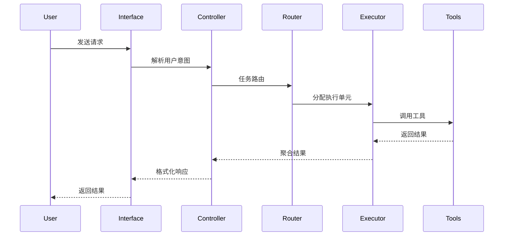

# AI Agent系统架构设计

> 基于Claude Code等成功产品的完整系统架构设计方案

## 1. 架构概览

### 1.1 整体架构
```
┌─────────────────────────────────────────────────────────────┐
│                    用户接口层 (Interface Layer)                │
│  CLI Interface │ Web Interface │ IDE Plugin │ API Gateway    │
├─────────────────────────────────────────────────────────────┤
│                   控制器层 (Controller Layer)                 │
│   Main Agent Controller │ Task Router │ Session Manager     │
├─────────────────────────────────────────────────────────────┤
│                    执行层 (Execution Layer)                   │
│  Sub Agents │ Tool Executor │ Model Gateway │ Hook Manager   │
├─────────────────────────────────────────────────────────────┤
│                  基础设施层 (Infrastructure Layer)             │
│ Context Manager│Memory Store│Config Manager│Telemetry│Cache  │
└─────────────────────────────────────────────────────────────┘
```

### 1.2 架构特征
- **分层设计**：清晰的职责分离
- **高内聚低耦合**：模块间最小依赖
- **水平可扩展**：支持分布式部署
- **垂直可扩展**：支持功能插件

## 2. 核心组件设计

### 2.1 Main Agent Controller

**职责**：统筹整个AI Agent的执行流程

**核心功能**：
```typescript
interface MainAgentController {
  // 请求处理
  handleUserRequest(request: UserRequest): Promise<Response>
  
  // 任务分发
  dispatchTask(task: Task): Promise<TaskResult>
  
  // 上下文管理
  manageContext(context: Context): Context
  
  // 状态跟踪
  trackExecution(executionId: string): ExecutionStatus
}
```

**设计模式**：
- **Command Pattern**：将用户请求封装为命令
- **Observer Pattern**：监听执行状态变化
- **Strategy Pattern**：根据任务类型选择执行策略

### 2.2 Task Router

**职责**：智能路由任务到最适合的执行单元

**路由策略**：
```python
class TaskRouter:
    def route_task(self, task: Task) -> ExecutionUnit:
        # 复杂度评估
        complexity = self.assess_complexity(task)
        
        if complexity == "simple":
            return DirectToolExecutor()
        elif complexity == "medium":
            return MainAgentExecutor()
        elif complexity == "complex":
            return SubAgentExecutor()
        else:
            return DistributedExecutor()
    
    def assess_complexity(self, task: Task) -> str:
        factors = {
            'steps_count': len(task.steps),
            'dependencies': len(task.dependencies),
            'context_size': task.context.size,
            'time_estimate': task.estimated_duration
        }
        return self.complexity_model.predict(factors)
```

### 2.3 Sub Agent System

**架构设计**：
```
Main Agent
    ├── Sub Agent Pool
    │   ├── General Purpose Agent
    │   ├── Code Search Agent  
    │   ├── Documentation Agent
    │   └── Testing Agent
    ├── Agent Factory
    └── Result Aggregator
```

**Sub Agent生命周期**：
1. **创建**：根据任务类型动态创建
2. **初始化**：加载专用提示词和工具集
3. **执行**：独立上下文中执行任务
4. **报告**：返回精炼结果给Main Agent
5. **销毁**：释放资源，清理上下文

### 2.4 Tool Ecosystem

**工具分类体系**：
```yaml
基础工具类:
  - 文件操作: Read, Write, Edit, MultiEdit
  - 搜索工具: Grep, Glob, Find
  - 版本控制: Git, SVN

开发工具类:
  - 代码工具: Lint, Test, Build, Debug
  - 数据库工具: Query, Migration, Backup
  - 部署工具: Docker, K8s, CI/CD

AI增强类:
  - Task: Sub Agent调度
  - WebFetch: 内容获取和分析
  - TodoWrite: 任务管理

扩展工具类:
  - 通过MCP协议接入第三方工具
  - 自定义业务逻辑工具
```

**工具抽象层**：
```typescript
interface Tool {
  name: string
  description: string
  inputSchema: JSONSchema
  outputSchema: JSONSchema
  permissions: Permission[]
  
  // 核心执行方法
  execute(input: ToolInput, context: Context): Promise<ToolOutput>
  
  // 验证输入
  validateInput(input: any): ValidationResult
  
  // 权限检查
  checkPermissions(context: Context): boolean
}
```

## 3. 数据流设计

### 3.1 请求处理流程


### 3.2 上下文传递机制
```python
class Context:
    def __init__(self):
        self.user_context = {}      # 用户信息
        self.session_context = {}   # 会话状态
        self.task_context = {}      # 任务上下文
        self.system_context = {}    # 系统环境
    
    def create_sub_context(self, task_type: str) -> 'SubContext':
        """为Sub Agent创建隔离的上下文"""
        return SubContext(
            task_specific=self.extract_relevant_info(task_type),
            shared_resources=self.get_shared_resources(),
            parent_context=self
        )
```

### 3.3 结果聚合模式
```typescript
class ResultAggregator {
  aggregateResults(results: TaskResult[]): AggregatedResult {
    return {
      primaryResult: this.selectPrimaryResult(results),
      supportingData: this.extractSupportingData(results),
      confidence: this.calculateConfidence(results),
      metadata: this.collectMetadata(results)
    }
  }
  
  private selectPrimaryResult(results: TaskResult[]): any {
    // 根据置信度和相关性选择主要结果
  }
}
```

## 4. 控制流设计

### 4.1 状态机模型
```python
from enum import Enum

class AgentState(Enum):
    IDLE = "idle"
    ANALYZING = "analyzing"
    PLANNING = "planning"
    EXECUTING = "executing"
    WAITING = "waiting"
    COMPLETED = "completed"
    ERROR = "error"

class AgentStateMachine:
    def __init__(self):
        self.state = AgentState.IDLE
        self.transitions = {
            AgentState.IDLE: [AgentState.ANALYZING],
            AgentState.ANALYZING: [AgentState.PLANNING, AgentState.ERROR],
            AgentState.PLANNING: [AgentState.EXECUTING, AgentState.ERROR],
            AgentState.EXECUTING: [AgentState.WAITING, AgentState.COMPLETED, AgentState.ERROR],
            AgentState.WAITING: [AgentState.EXECUTING, AgentState.ERROR],
            AgentState.COMPLETED: [AgentState.IDLE],
            AgentState.ERROR: [AgentState.IDLE, AgentState.ANALYZING]
        }
```

### 4.2 异常处理策略
```yaml
异常级别处理:
  WARNING:
    策略: 记录日志，继续执行
    示例: 工具输出格式不完整
  
  ERROR:
    策略: 自动重试，回退到备选方案
    示例: API调用失败，网络超时
  
  CRITICAL:
    策略: 立即停止，保存状态，通知用户
    示例: 权限不足，恶意操作检测
  
  FATAL:
    策略: 系统重启，数据恢复
    示例: 内存溢出，系统崩溃
```

### 4.3 并发控制
```python
import asyncio
from asyncio import Semaphore

class ConcurrencyManager:
    def __init__(self):
        self.tool_semaphore = Semaphore(10)    # 工具并发限制
        self.model_semaphore = Semaphore(3)    # 模型调用限制
        self.agent_semaphore = Semaphore(5)    # Agent并发限制
    
    async def execute_with_limit(self, task_type: str, task: Callable):
        semaphore = self.get_semaphore(task_type)
        async with semaphore:
            return await task()
```

## 5. 可扩展性设计

### 5.1 插件架构
```typescript
interface Plugin {
  name: string
  version: string
  dependencies: string[]
  
  // 生命周期方法
  initialize(context: PluginContext): Promise<void>
  activate(): Promise<void>
  deactivate(): Promise<void>
  
  // 扩展点
  contributeTools?(): Tool[]
  contributePrompts?(): PromptTemplate[]
  contributeAgents?(): AgentDefinition[]
}

class PluginManager {
  private plugins: Map<string, Plugin> = new Map()
  
  async loadPlugin(pluginPath: string): Promise<void> {
    // 动态加载插件
  }
  
  async resolvePluginDependencies(): Promise<void> {
    // 解析插件依赖关系
  }
}
```

### 5.2 MCP协议集成
```python
class MCPConnector:
    def __init__(self):
        self.servers = {}
        self.transports = {}
    
    async def connect_server(self, server_config: ServerConfig):
        """连接MCP服务器"""
        transport = self.create_transport(server_config)
        server = MCPServer(transport)
        
        await server.initialize()
        self.servers[server_config.name] = server
    
    async def get_tools(self, server_name: str) -> List[Tool]:
        """获取服务器提供的工具"""
        server = self.servers[server_name]
        return await server.list_tools()
```

### 5.3 分布式架构支持
```yaml
分布式组件:
  Agent Manager:
    职责: Agent实例管理和负载均衡
    技术: Kubernetes + Docker
  
  Message Queue:
    职责: 异步任务处理和结果传递
    技术: Redis + RabbitMQ
  
  Shared Storage:
    职责: 上下文和状态持久化
    技术: PostgreSQL + Redis
  
  Service Discovery:
    职责: 服务注册和发现
    技术: Consul + etcd
```

## 6. 性能优化设计

### 6.1 缓存策略
```python
class CacheManager:
    def __init__(self):
        self.l1_cache = {}          # 内存缓存
        self.l2_cache = Redis()     # 分布式缓存
        self.l3_cache = Database()  # 持久化缓存
    
    async def get(self, key: str) -> Optional[Any]:
        # L1缓存检查
        if key in self.l1_cache:
            return self.l1_cache[key]
        
        # L2缓存检查
        value = await self.l2_cache.get(key)
        if value:
            self.l1_cache[key] = value
            return value
        
        # L3缓存检查
        value = await self.l3_cache.get(key)
        if value:
            await self.l2_cache.set(key, value, ttl=3600)
            self.l1_cache[key] = value
            return value
        
        return None
```

### 6.2 资源池管理
```python
class ResourcePool:
    def __init__(self, resource_type: str, max_size: int):
        self.resource_type = resource_type
        self.max_size = max_size
        self.available = asyncio.Queue(max_size)
        self.in_use = set()
    
    async def acquire(self) -> Resource:
        if self.available.empty() and len(self.in_use) < self.max_size:
            resource = await self.create_resource()
        else:
            resource = await self.available.get()
        
        self.in_use.add(resource)
        return resource
    
    async def release(self, resource: Resource):
        self.in_use.remove(resource)
        await self.available.put(resource)
```

## 7. 监控与可观测性

### 7.1 指标收集
```yaml
性能指标:
  - 响应时间分布
  - 吞吐量变化
  - 错误率统计
  - 资源利用率

业务指标:
  - 任务成功率
  - 用户满意度
  - Token使用效率
  - 成本分析

系统指标:
  - 内存使用情况
  - CPU负载
  - 网络延迟
  - 存储I/O
```

### 7.2 日志系统
```python
import structlog

logger = structlog.get_logger()

class StructuredLogger:
    def log_request(self, request_id: str, user_id: str, action: str):
        logger.info(
            "user_request",
            request_id=request_id,
            user_id=user_id,
            action=action,
            timestamp=datetime.utcnow()
        )
    
    def log_tool_execution(self, tool_name: str, duration: float, success: bool):
        logger.info(
            "tool_execution",
            tool_name=tool_name,
            duration=duration,
            success=success,
            timestamp=datetime.utcnow()
        )
```

### 7.3 追踪系统
```python
from opentelemetry import trace
from opentelemetry.exporter.jaeger.thrift import JaegerExporter

tracer = trace.get_tracer(__name__)

class TracingManager:
    def __init__(self):
        self.tracer = tracer
    
    def trace_agent_execution(self, agent_type: str):
        def decorator(func):
            async def wrapper(*args, **kwargs):
                with self.tracer.start_as_current_span(f"agent_execution_{agent_type}"):
                    return await func(*args, **kwargs)
            return wrapper
        return decorator
```

## 8. 安全架构

### 8.1 多层安全模型
```
┌─────────────────────────────────┐
│      应用安全层 (Application)      │  权限控制、输入验证
├─────────────────────────────────┤
│       传输安全层 (Transport)       │  TLS/HTTPS、API认证  
├─────────────────────────────────┤
│       数据安全层 (Data)          │  加密存储、脱敏处理
├─────────────────────────────────┤
│       基础设施层 (Infrastructure)  │  网络隔离、容器安全
└─────────────────────────────────┘
```

### 8.2 权限管理
```python
class PermissionManager:
    def __init__(self):
        self.rbac = RoleBasedAccessControl()
        self.policies = PolicyEngine()
    
    def check_permission(self, user: User, resource: str, action: str) -> bool:
        # RBAC检查
        if not self.rbac.has_permission(user.role, resource, action):
            return False
        
        # 策略检查
        if not self.policies.evaluate(user, resource, action):
            return False
        
        return True
```

## 9. 部署架构

### 9.1 容器化部署
```yaml
# docker-compose.yml
version: '3.8'
services:
  ai-agent:
    image: ai-agent:latest
    ports:
      - "8000:8000"
    environment:
      - REDIS_URL=redis://redis:6379
      - DATABASE_URL=postgresql://postgres:password@db:5432/aiagent
    depends_on:
      - redis
      - db
  
  redis:
    image: redis:7-alpine
    ports:
      - "6379:6379"
  
  db:
    image: postgres:15
    environment:
      POSTGRES_DB: aiagent
      POSTGRES_USER: postgres
      POSTGRES_PASSWORD: password
```

### 9.2 Kubernetes部署
```yaml
apiVersion: apps/v1
kind: Deployment
metadata:
  name: ai-agent
spec:
  replicas: 3
  selector:
    matchLabels:
      app: ai-agent
  template:
    metadata:
      labels:
        app: ai-agent
    spec:
      containers:
      - name: ai-agent
        image: ai-agent:latest
        ports:
        - containerPort: 8000
        env:
        - name: REDIS_URL
          valueFrom:
            configMapKeyRef:
              name: app-config
              key: redis-url
        resources:
          requests:
            memory: "1Gi"
            cpu: "500m"
          limits:
            memory: "2Gi"
            cpu: "1000m"
```

## 10. 架构决策记录 (ADR)

### ADR-001: 选择分层架构模式

**状态**: 已接受

**上下文**: 需要设计一个可维护、可扩展的AI Agent系统

**决策**: 采用分层架构模式，将系统分为接口层、控制层、执行层和基础设施层

**后果**: 
- 优点：职责清晰，易于维护和测试
- 缺点：可能引入一定的性能开销
- 风险：需要注意避免层次间的紧耦合

### ADR-002: 采用Multi-Agent架构

**状态**: 已接受

**上下文**: 单一Agent难以有效处理复杂多样的任务

**决策**: 采用Main-Sub Agent架构，通过专用Agent处理特定任务

**后果**:
- 优点：任务隔离，上下文优化，专业化处理
- 缺点：增加系统复杂度
- 风险：Agent间通信开销

---

*"好的架构是演化出来的，而不是设计出来的"*