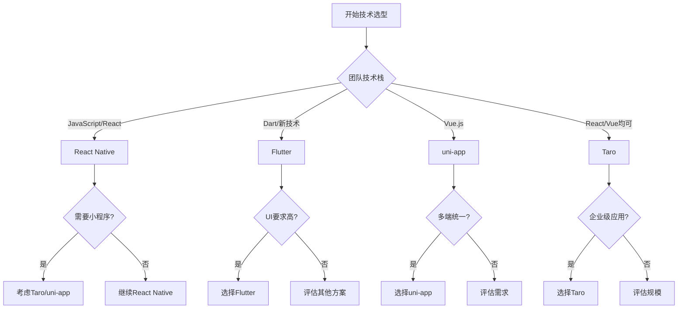

# 📱 移动端跨平台开发完整指南

## 🎯 概述

本指南提供了完整的移动端跨平台开发解决方案，帮助团队选择最适合的技术栈，实现一套代码同时支持Android、iOS和小程序平台，最大化代码复用率并降低未来的迁移成本。

## 🏗️ 技术选型决策树

### 决策流程图



### 技术栈选择指南

#### 1. Flutter (推荐指数: ⭐⭐⭐⭐⭐)
**适用场景**：
- 高性能要求的应用
- 复杂动画和自定义UI
- 新项目或全面重构
- 团队愿意学习新技术

**优势**：
- 原生级别性能
- UI一致性极佳
- 热重载开发体验好
- Google官方支持

**劣势**：
- Dart语言学习成本
- 包体积相对较大
- 不支持小程序

#### 2. React Native (推荐指数: ⭐⭐⭐⭐)
**适用场景**：
- 团队有React经验
- 需要原生模块集成
- 社区生态要求高
- 快速原型开发

**优势**：
- JavaScript生态丰富
- 开发者资源充足
- 社区活跃度高
- 新架构性能提升明显

**劣势**：
- 性能不如Flutter
- 版本升级困难
- 不直接支持小程序

#### 3. uni-app (推荐指数: ⭐⭐⭐⭐⭐)
**适用场景**：
- 需要支持小程序
- Vue技术栈团队
- 中小型应用开发
- 快速多端发布

**优势**：
- 一套代码多端运行
- 支持所有小程序平台
- Vue语法友好
- 开发效率高

**劣势**：
- 原生性能受限
- 复杂交互支持有限
- 依赖官方更新

#### 4. Taro (推荐指数: ⭐⭐⭐⭐)
**适用场景**：
- 企业级应用
- React技术栈
- 需要小程序支持
- 京东生态项目

**优势**：
- React/Vue双支持
- 企业级解决方案
- 京东团队维护
- 转译机制成熟

**劣势**：
- 学习曲线陡峭
- 调试相对困难
- 性能优化复杂

## 🔄 三端统一开发策略

### 架构设计原则

```typescript
// 平台适配层架构
interface PlatformAdapter {
  // 核心能力抽象
  storage: StorageAPI;
  network: NetworkAPI;
  device: DeviceAPI;
  ui: UIComponentsAPI;
  
  // 平台特定功能
  platform: {
    name: 'ios' | 'android' | 'wechat' | 'alipay';
    specific: PlatformSpecificAPI;
  };
}

// 业务逻辑层（平台无关）
class BusinessLogic {
  constructor(private adapter: PlatformAdapter) {}
  
  async saveData(data: any) {
    // 统一的业务逻辑
    return this.adapter.storage.save(data);
  }
}
```

### 代码组织结构

```
project/
├── src/
│   ├── core/              # 核心业务逻辑（100%复用）
│   │   ├── models/
│   │   ├── services/
│   │   └── utils/
│   ├── components/         # UI组件
│   │   ├── common/        # 通用组件（90%复用）
│   │   └── platform/      # 平台特定组件
│   ├── platforms/         # 平台适配层
│   │   ├── android/
│   │   ├── ios/
│   │   ├── wechat/
│   │   └── alipay/
│   └── pages/            # 页面逻辑（80%复用）
```

### 条件编译策略

```javascript
// uni-app条件编译示例
// #ifdef H5
// H5平台特定代码
import { webSpecific } from './web';
// #endif

// #ifdef MP-WEIXIN
// 微信小程序特定代码
import { wxSpecific } from './wechat';
// #endif

// #ifdef APP-PLUS
// App平台特定代码
import { appSpecific } from './app';
// #endif

// 通用代码
export function crossPlatformFunction() {
  // 所有平台共享的逻辑
}
```

## 🎨 UI/UX适配最佳实践

### 响应式设计系统

```scss
// 设计令牌系统
:root {
  // 间距系统
  --spacing-xs: 4px;
  --spacing-sm: 8px;
  --spacing-md: 16px;
  --spacing-lg: 24px;
  --spacing-xl: 32px;
  
  // 字体系统
  --font-size-xs: 12px;
  --font-size-sm: 14px;
  --font-size-md: 16px;
  --font-size-lg: 18px;
  --font-size-xl: 20px;
  
  // 颜色系统
  --color-primary: #007AFF;    // iOS风格
  --color-primary-android: #2196F3; // Material Design
  --color-primary-wechat: #07C160;  // 微信绿
}

// 平台适配mixins
@mixin platform-style($platform) {
  @if $platform == 'ios' {
    font-family: -apple-system, 'SF Pro Text';
    letter-spacing: -0.01em;
  } @else if $platform == 'android' {
    font-family: 'Roboto', sans-serif;
    letter-spacing: 0.02em;
  } @else if $platform == 'wechat' {
    font-family: -apple-system, 'PingFang SC';
    letter-spacing: 0;
  }
}
```

### 组件适配示例

```tsx
// 跨平台按钮组件
import React from 'react';
import { Platform } from 'react-native';

const CrossPlatformButton: React.FC<ButtonProps> = ({ 
  title, 
  onPress,
  variant = 'primary' 
}) => {
  const getStyles = () => {
    const base = {
      padding: 12,
      borderRadius: Platform.OS === 'ios' ? 8 : 4,
      backgroundColor: variant === 'primary' ? '#007AFF' : '#F2F2F7'
    };
    
    if (Platform.OS === 'android') {
      return {
        ...base,
        elevation: 2,
        backgroundColor: variant === 'primary' ? '#2196F3' : '#E0E0E0'
      };
    }
    
    return base;
  };
  
  return (
    <TouchableOpacity style={getStyles()} onPress={onPress}>
      <Text>{title}</Text>
    </TouchableOpacity>
  );
};
```

## 🚀 渐进式迁移策略

### Phase 1: 评估和规划（1-2周）

```typescript
interface MigrationAssessment {
  currentStack: {
    platform: string;
    framework: string;
    dependencies: string[];
    codebase: {
      loc: number;
      components: number;
      screens: number;
    };
  };
  
  targetStack: {
    framework: 'Flutter' | 'ReactNative' | 'UniApp' | 'Taro';
    platforms: ('iOS' | 'Android' | 'WeChat' | 'Alipay')[];
  };
  
  complexity: {
    score: number; // 1-10
    factors: string[];
    risks: string[];
  };
  
  timeline: {
    phases: Phase[];
    totalWeeks: number;
  };
}
```

### Phase 2: 核心模块迁移（2-4周）

```javascript
// 迁移优先级
const migrationPriority = [
  {
    module: '网络请求层',
    complexity: 'low',
    impact: 'high',
    strategy: '创建统一的API适配层'
  },
  {
    module: '状态管理',
    complexity: 'medium',
    impact: 'high',
    strategy: '迁移到跨平台状态管理方案'
  },
  {
    module: '工具函数',
    complexity: 'low',
    impact: 'medium',
    strategy: '直接复用或小幅调整'
  },
  {
    module: 'UI组件',
    complexity: 'high',
    impact: 'high',
    strategy: '逐步重写，优先通用组件'
  }
];
```

### Phase 3: 功能模块迁移（4-8周）

```typescript
// 功能模块迁移模板
class ModuleMigrator {
  async migrate(module: Module) {
    // 1. 分析依赖
    const deps = await this.analyzeDependencies(module);
    
    // 2. 创建适配层
    const adapter = await this.createAdapter(deps);
    
    // 3. 迁移业务逻辑
    const logic = await this.migrateBusinessLogic(module);
    
    // 4. 重构UI层
    const ui = await this.refactorUI(module);
    
    // 5. 测试验证
    await this.test(module);
    
    return { adapter, logic, ui };
  }
}
```

### Phase 4: 优化和发布（2-3周）

```yaml
# CI/CD多平台构建配置
name: Multi-Platform Build
on:
  push:
    branches: [main]

jobs:
  build-ios:
    runs-on: macos-latest
    steps:
      - name: Build iOS
        run: |
          flutter build ios --release
          # 或 react-native run-ios --configuration Release
          
  build-android:
    runs-on: ubuntu-latest
    steps:
      - name: Build Android
        run: |
          flutter build apk --release
          # 或 cd android && ./gradlew assembleRelease
          
  build-miniprogram:
    runs-on: ubuntu-latest
    steps:
      - name: Build WeChat MiniProgram
        run: |
          npm run build:weapp
          # uni-app或Taro构建命令
```

## 📊 代码复用率优化

### 复用率评估模型

```typescript
interface ReuseMetrics {
  overall: number;           // 总体复用率
  byLayer: {
    business: number;       // 业务逻辑层 (目标: 95%+)
    ui: number;            // UI组件层 (目标: 70%+)
    platform: number;      // 平台特定 (目标: 20%-)
  };
  byPlatform: {
    [platform: string]: number;
  };
}

// 计算复用率
function calculateReuseRate(codebase: Codebase): ReuseMetrics {
  const shared = codebase.shared.loc;
  const total = codebase.total.loc;
  const platformSpecific = codebase.platforms.reduce(
    (sum, p) => sum + p.loc, 0
  );
  
  return {
    overall: (shared / total) * 100,
    byLayer: {
      business: (codebase.business.shared / codebase.business.total) * 100,
      ui: (codebase.ui.shared / codebase.ui.total) * 100,
      platform: (platformSpecific / total) * 100
    },
    byPlatform: calculatePlatformMetrics(codebase)
  };
}
```

### 提高复用率的技巧

1. **抽象平台差异**
```typescript
// 平台差异抽象示例
abstract class PlatformService {
  abstract requestPermission(type: string): Promise<boolean>;
  abstract openCamera(): Promise<Image>;
  abstract saveToAlbum(image: Image): Promise<void>;
}

// iOS实现
class IOSService extends PlatformService {
  async requestPermission(type: string) {
    // iOS特定实现
  }
}

// Android实现
class AndroidService extends PlatformService {
  async requestPermission(type: string) {
    // Android特定实现
  }
}
```

2. **组件化设计**
```tsx
// 高复用性组件设计
const CrossPlatformList = ({ 
  data, 
  renderItem,
  platform = getCurrentPlatform() 
}) => {
  // 核心逻辑统一
  const processedData = useMemo(() => 
    processData(data), [data]
  );
  
  // 平台特定渲染
  if (platform === 'wechat') {
    return <ScrollView>{/* 微信小程序实现 */}</ScrollView>;
  }
  
  return <FlatList data={processedData} renderItem={renderItem} />;
};
```

## 🔧 开发工具链配置

### 统一的开发环境

```json
// package.json - 多平台脚本配置
{
  "scripts": {
    "dev:h5": "uni-app dev:h5",
    "dev:weapp": "uni-app dev:mp-weixin",
    "dev:ios": "react-native run-ios",
    "dev:android": "react-native run-android",
    "build:all": "npm-run-all build:*",
    "build:h5": "uni-app build:h5",
    "build:weapp": "uni-app build:mp-weixin",
    "build:app": "flutter build apk && flutter build ios"
  }
}
```

### VSCode配置

```json
// .vscode/settings.json
{
  "files.associations": {
    "*.nvue": "vue",
    "*.ux": "vue",
    "*.wxml": "html",
    "*.wxss": "css",
    "*.acss": "css",
    "*.axml": "html"
  },
  "emmet.includeLanguages": {
    "wxml": "html",
    "axml": "html"
  },
  "[dart]": {
    "editor.formatOnSave": true,
    "editor.formatOnType": true
  }
}
```

## 📈 性能优化指南

### 跨平台性能优化策略

```typescript
// 性能监控基础设施
class PerformanceMonitor {
  private metrics: Map<string, PerformanceMetric> = new Map();
  
  measure(name: string, fn: () => void) {
    const start = performance.now();
    fn();
    const duration = performance.now() - start;
    
    this.metrics.set(name, {
      duration,
      timestamp: Date.now(),
      platform: getPlatform()
    });
    
    if (duration > 16.67) { // 超过一帧时间
      console.warn(`Performance issue: ${name} took ${duration}ms`);
    }
  }
  
  report() {
    // 上报性能数据
    return Array.from(this.metrics.entries());
  }
}
```

### 包体积优化

```javascript
// webpack配置示例
module.exports = {
  optimization: {
    splitChunks: {
      chunks: 'all',
      cacheGroups: {
        vendor: {
          test: /[\\/]node_modules[\\/]/,
          name: 'vendors',
          priority: -10
        },
        common: {
          minChunks: 2,
          priority: -20,
          reuseExistingChunk: true
        }
      }
    },
    usedExports: true,
    sideEffects: false
  }
};
```

## 🚨 常见问题和解决方案

### 问题1: 平台API差异
**解决方案**：创建统一的API适配层

```typescript
// api-adapter.ts
export class APIAdapter {
  static async getUserLocation() {
    if (isWechat()) {
      return new Promise((resolve) => {
        wx.getLocation({
          success: resolve,
          fail: () => resolve(null)
        });
      });
    }
    
    if (isReactNative()) {
      return Geolocation.getCurrentPosition();
    }
    
    if (isFlutter()) {
      // Flutter channel调用
      return MethodChannel('location').invokeMethod('getLocation');
    }
  }
}
```

### 问题2: 样式兼容性
**解决方案**：使用样式预处理和运行时适配

```scss
// styles/mixins.scss
@mixin safe-area-inset($property, $value) {
  #{$property}: $value;
  #{$property}: calc(#{$value} + env(safe-area-inset-top));
  #{$property}: calc(#{$value} + constant(safe-area-inset-top));
}

// 使用
.header {
  @include safe-area-inset(padding-top, 20px);
}
```

### 问题3: 性能瓶颈
**解决方案**：平台特定优化

```javascript
// 列表渲染优化
const OptimizedList = ({ data }) => {
  if (Platform.OS === 'web') {
    // Web端使用虚拟滚动
    return <VirtualList data={data} />;
  }
  
  if (Platform.OS === 'android' || Platform.OS === 'ios') {
    // 原生端使用FlatList
    return (
      <FlatList 
        data={data}
        removeClippedSubviews={true}
        maxToRenderPerBatch={10}
        windowSize={10}
      />
    );
  }
  
  // 小程序使用分页加载
  return <ScrollView onScrollToLower={loadMore}>
    {data.slice(0, pageSize).map(renderItem)}
  </ScrollView>;
};
```

## 🎯 最佳实践总结

### Do's ✅
1. **始终优先考虑代码复用**
2. **建立清晰的平台适配层**
3. **使用TypeScript提高代码质量**
4. **编写平台无关的业务逻辑**
5. **充分利用条件编译**
6. **保持组件的高内聚低耦合**
7. **建立统一的设计系统**
8. **持续监控各平台性能**

### Don'ts ❌
1. **避免过度使用平台特定代码**
2. **不要忽视平台设计规范**
3. **避免直接操作DOM/原生视图**
4. **不要忽略包体积优化**
5. **避免使用已废弃的API**
6. **不要跳过兼容性测试**
7. **避免硬编码平台判断**
8. **不要忽视用户体验一致性**

## 📚 推荐资源

### 官方文档
- [Flutter官方文档](https://flutter.dev/docs)
- [React Native官方文档](https://reactnative.dev)
- [uni-app官方文档](https://uniapp.dcloud.io)
- [Taro官方文档](https://taro.zone)

### 学习资源
- Flutter实战：[Flutter in Action](https://www.manning.com/books/flutter-in-action)
- React Native：[React Native in Action](https://www.manning.com/books/react-native-in-action)
- 小程序开发：[微信小程序开发指南](https://developers.weixin.qq.com/miniprogram/dev/framework/)

### 社区资源
- [Flutter中文社区](https://flutterchina.club)
- [React Native中文网](https://reactnative.cn)
- [uni-app插件市场](https://ext.dcloud.net.cn)
- [Taro物料市场](https://taro-ext.jd.com)

---

*最后更新：2025-01-04*
*作者：Development-Standards Team*
*版本：1.0.0*