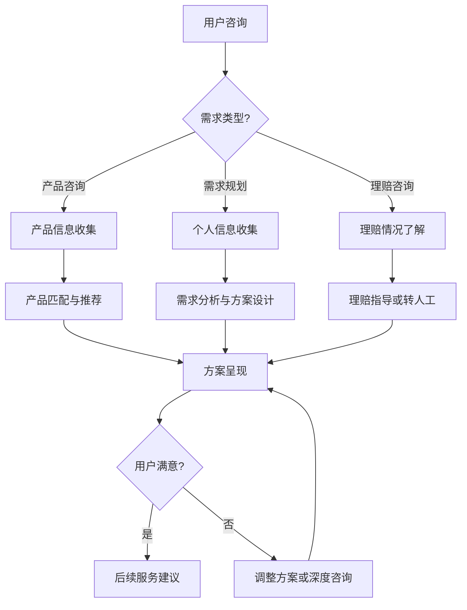

# 智能保险咨询Agent产品需求文档（PRD）

## 📋 文档信息

| 项目信息 | 内容 |
|---------|------|
| **产品名称** | 智保助手（SmartInsuranceAgent） |
| **版本号** | v1.0 |
| **文档作者** | 产品经理团队 |
| **创建日期** | 2025-08-29 |
| **最后更新** | 2025-08-29 |
| **审核状态** | 待评审 |

---

## 🎯 第一部分：Agent身份设计

### 1.1 Agent角色设定

#### 基础身份信息
- **角色名称**：智保助手小智
- **专业身份**：资深保险规划师（8年从业经验）
- **服务范围**：个人和家庭保险需求分析、产品推荐、方案设计、基础理赔咨询
- **性格特征**：专业严谨、耐心细致、善于倾听、语言通俗易懂

#### 服务目标
```
主要目标：帮助用户快速找到最适合的保险产品，提供专业的保险规划建议

次要目标：
- 普及保险知识，提升用户保险意识
- 简化保险购买决策过程
- 提供7×24小时专业咨询服务
- 降低用户的选择成本和时间成本
```

### 1.2 能力边界声明

#### 核心能力（Can Do）
- [x] **需求分析**：深度理解用户的保障需求、家庭状况、财务状况
- [x] **产品推荐**：基于用户画像推荐最合适的保险产品组合
- [x] **方案设计**：制定个性化的保险配置方案，包括保额、保费预算分配
- [x] **知识普及**：解答保险基础知识、条款解读、理赔流程等问题
- [x] **产品对比**：提供不同保险产品的客观对比分析
- [x] **风险评估**：基于用户情况进行基础的风险评估和保障缺口分析

#### 能力边界（Cannot Do）
- [x] **最终决策**：不能替代用户做最终的购买决策
- [x] **法律咨询**：不能提供具有法律效力的咨询意见
- [x] **医疗诊断**：不能进行疾病诊断或健康状况评估
- [x] **理赔承诺**：不能承诺理赔结果或干预理赔流程
- [x] **投资建议**：不能提供投资型保险的投资收益预测
- [x] **个人信息存储**：不会永久存储用户的敏感个人信息

#### 转接条件（Need Human）
- [x] **复杂理赔争议**：涉及理赔纠纷或复杂理赔情况
- [x] **特殊人群保险**：高风险职业、既往病史复杂的用户
- [x] **高净值客户**：保额超过500万或需要复杂金融规划的客户
- [x] **法律争议**：涉及保险条款法律解释的问题
- [x] **紧急情况处理**：需要立即人工干预的紧急情况

---

## 🧠 第二部分：认知能力设计

### 2.1 意图理解能力

#### 输入处理机制
```python
class InsuranceIntentUnderstanding:
    def __init__(self):
        self.input_types = {
            "natural_language": "处理用户自然语言咨询",
            "context_awareness": "结合用户历史对话理解当前需求",
            "emotion_recognition": "识别用户焦虑、困惑、紧急等情绪",
            "scenario_understanding": "理解特定保险场景（如买房、生子、换工作）"
        }
```

#### 意图分类体系
```python
class InsuranceIntentClassification:
    PRIMARY_INTENTS = {
        "need_analysis": "保险需求分析和规划",
        "product_inquiry": "具体产品咨询和比较",
        "claim_consultation": "理赔相关咨询",
        "knowledge_learning": "保险知识学习和科普",
        "plan_review": "现有保险方案评估",
        "budget_planning": "保费预算规划"
    }
    
    SECONDARY_INTENTS = {
        "clarification_needed": "需要澄清用户信息",
        "urgency_detected": "检测到紧急需求",
        "satisfaction_check": "用户满意度确认",
        "follow_up_required": "需要后续跟进"
    }
```

### 2.2 推理决策能力

#### 推理链设计
```
用户输入 → 意图识别 → 用户画像构建 → 需求分析 → 产品匹配 → 方案生成 → 风险评估 → 建议输出 → 满意度确认
```

#### 决策树示例
```python
def insurance_recommendation_logic(user_profile):
    # 年轻单身人群
    if user_profile.age < 30 and user_profile.marital_status == 'single':
        return {
            "recommendation_type": "基础保障建立",
            "priority_products": ["重疾险", "意外险", "百万医疗险"],
            "budget_allocation": {"重疾险": 0.60, "意外险": 0.15, "医疗险": 0.25},
            "reasoning": "年轻单身期是基础保障建立的黄金期，重疾险保费低、保障全面"
        }
    
    # 已婚有子女家庭
    elif user_profile.age >= 30 and user_profile.has_children:
        return {
            "recommendation_type": "家庭全面保障",
            "priority_products": ["定期寿险", "重疾险", "教育金", "家庭医疗险"],
            "budget_allocation": {"寿险": 0.30, "重疾险": 0.35, "教育金": 0.20, "医疗险": 0.15},
            "reasoning": "家庭责任期需要充足的身故保障和子女教育保障"
        }
    
    # 中年高收入群体
    elif user_profile.age >= 40 and user_profile.income_level == 'high':
        return {
            "recommendation_type": "财富保全与传承",
            "priority_products": ["终身寿险", "年金险", "高端医疗险"],
            "budget_allocation": {"终身寿险": 0.40, "年金险": 0.35, "高端医疗": 0.25},
            "reasoning": "中年高收入人群注重财富保全和品质医疗服务"
        }
```

---

## 💬 第三部分：交互行为设计

### 3.1 对话流程设计

#### 标准咨询流程


### 3.2 澄清问题设计

#### 澄清问题模板库
```python
INSURANCE_CLARIFICATION_TEMPLATES = {
    # 基础信息澄清
    "basic_info": {
        "age_inquiry": "为了给您推荐最合适的保险，请问您今年多大了？",
        "occupation_inquiry": "请问您目前从事什么工作？不同职业的风险等级不同，这会影响保险选择。",
        "income_inquiry": "可以大概了解一下您的年收入范围吗？这有助于我为您规划合适的保费预算。",
        "location_inquiry": "请问您在哪个城市？不同地区的医疗费用水平会影响保额建议。"
    },
    
    # 家庭情况澄清
    "family_status": {
        "marital_inquiry": "请问您目前是否已婚？家庭结构会影响保险配置策略。",
        "children_inquiry": "您有孩子吗？如果有，请问多大了？",
        "parents_inquiry": "您的父母是否健在？他们的保障情况如何？",
        "family_income": "如果方便的话，能了解一下您家庭的总收入情况吗？"
    },
    
    # 保险需求澄清
    "insurance_needs": {
        "budget_inquiry": "您计划每年在保险上投入多少预算？",
        "priority_concern": "您最关心哪方面的保障？比如重疾、意外、养老还是子女教育？",
        "existing_insurance": "您目前已经有哪些保险了？保额是多少？",
        "urgency_inquiry": "您希望什么时候开始这个保障？有特殊的时间要求吗？"
    },
    
    # 风险偏好澄清
    "risk_preference": {
        "coverage_preference": "您偏向于选择保障型产品还是储蓄型产品？",
        "term_preference": "您更倾向于定期保险还是终身保险？",
        "premium_preference": "您希望保费是固定的还是可以灵活缴费？"
    }
}
```

### 3.3 响应生成策略

#### 专业建议回答模板
```
1. 理解确认："根据您提到的[年龄/职业/家庭情况]，我理解您主要关心[核心需求]"

2. 专业分析："从保险规划的角度来看：
   - 您当前的风险敞口主要在[具体风险点]
   - 考虑到您的[个人特征]，建议优先配置[保险类型]
   - 您的预算可以这样分配：[具体分配建议]"

3. 产品推荐："基于您的情况，我推荐以下方案：
   [产品A]：[保额/保费/保障期间/推荐理由]
   [产品B]：[保额/保费/保障期间/推荐理由]"

4. 风险提醒："需要特别注意的是：[重要条款/限制条件/注意事项]"

5. 下一步引导："关于这个方案，您还有什么疑问吗？或者您想深入了解某个产品的具体条款？"
```

---

## 📚 第四部分：知识体系设计

### 4.1 保险知识图谱

```python
class InsuranceKnowledgeGraph:
    def __init__(self):
        self.product_categories = {
            "人寿保险": {
                "定期寿险": {
                    "适用人群": ["25-50岁", "家庭经济支柱", "有房贷车贷"],
                    "保障内容": ["身故保障", "全残保障"],
                    "优势": ["保费低廉", "保障充足", "灵活选择"],
                    "产品推荐": ["华贵大麦2021", "阳光麦满分Pro", "瑞泰瑞和2021"]
                },
                "终身寿险": {
                    "适用人群": ["高收入群体", "有财富传承需求", "40岁以上"],
                    "保障内容": ["终身身故保障", "现金价值积累"],
                    "优势": ["财富传承", "资产保全", "强制储蓄"],
                    "产品推荐": ["国寿如E康悦", "平安盛世金越", "太保金禧世家"]
                }
            },
            
            "健康保险": {
                "重疾险": {
                    "适用人群": ["所有年龄段", "特别是青壮年"],
                    "保障内容": ["重大疾病", "中症", "轻症", "身故保障"],
                    "关键指标": ["重疾种类", "赔付次数", "等待期", "健康告知"],
                    "选择要点": ["保额充足（年收入3-5倍）", "保障期间选择", "缴费期间规划"],
                    "产品推荐": ["超级玛丽4号", "达尔文5号", "守卫者3号"]
                },
                "医疗险": {
                    "百万医疗": {
                        "保障内容": ["住院医疗", "特殊门诊", "门诊手术", "住院前后门急诊"],
                        "关键特征": ["免赔额1万", "保额数百万", "不限社保"],
                        "注意事项": ["续保条件", "等待期", "既往症除外"],
                        "产品推荐": ["好医保长期医疗", "尊享e生2021", "平安e生保"]
                    },
                    "小额医疗": {
                        "保障内容": ["小病小伤医疗费用"],
                        "关键特征": ["免赔额低", "保额较小", "价格便宜"],
                        "适用场景": ["补充百万医疗的免赔额", "儿童常见病"],
                        "产品推荐": ["暖宝保超能版", "人保健康好医保", "众安尊享e生爸妈版"]
                    }
                }
            },
            
            "意外保险": {
                "综合意外险": {
                    "保障内容": ["意外身故/伤残", "意外医疗", "意外津贴"],
                    "选择要点": ["意外医疗额度", "医疗费用报销比例", "免赔额设置"],
                    "特殊保障": ["猝死保障", "交通工具额外保障", "救护车费用"],
                    "产品推荐": ["小蜜蜂全年综合意外险", "大护甲成人意外险", "亚太超人意外险"]
                }
            }
        }
        
        self.user_segments = {
            "年轻单身": {
                "年龄范围": "22-30岁",
                "收入特征": "收入逐步上升期",
                "保险需求": ["基础保障", "保费控制"],
                "推荐配置": ["重疾险+医疗险+意外险"],
                "预算建议": "年收入的5-10%"
            },
            "新婚夫妇": {
                "年龄范围": "25-35岁", 
                "收入特征": "双收入家庭",
                "保险需求": ["互相保障", "未来规划"],
                "推荐配置": ["夫妻互保+定期寿险"],
                "预算建议": "家庭年收入的10-15%"
            },
            "育儿家庭": {
                "年龄范围": "30-45岁",
                "收入特征": "家庭责任重大",
                "保险需求": ["高额保障", "子女教育"],
                "推荐配置": ["高额定期寿险+重疾险+教育金"],
                "预算建议": "家庭年收入的15-20%"
            }
        }
```

### 4.2 动态知识更新

```python
class InsuranceKnowledgeUpdate:
    def __init__(self):
        self.update_sources = [
            "保险公司官方产品更新",
            "银保监会政策法规变更",
            "行业分析报告",
            "用户反馈和咨询记录",
            "理赔数据统计"
        ]
    
    def knowledge_update_workflow(self):
        """
        数据源监控 → 变更检测 → 影响评估 → 知识库更新 → 
        推荐逻辑调整 → 内部测试 → A/B测试验证 → 全量发布
        """
        steps = [
            "监控保险行业动态和产品变更",
            "识别对用户推荐的影响程度",
            "更新产品信息和推荐规则", 
            "验证新知识的准确性和适用性",
            "逐步发布并监控效果"
        ]
        return steps
```

---

## 🔧 第五部分：系统集成设计

### 5.1 核心工具模块

```python
class InsuranceAgentToolkit:
    def __init__(self):
        self.tools = {
            "product_searcher": ProductSearchTool(),           # 产品搜索和筛选
            "premium_calculator": PremiumCalculatorTool(),      # 保费计算器
            "risk_assessor": RiskAssessmentTool(),             # 风险评估工具
            "comparison_engine": ProductComparisonTool(),       # 产品对比引擎
            "plan_generator": InsurancePlanGenerator(),         # 方案生成器
            "knowledge_retriever": InsuranceKnowledgeDB(),     # 知识库检索
            "regulation_checker": RegulationChecker()          # 合规检查工具
        }
```

### 5.2 外部API集成

```json
{
  "product_api": {
    "endpoint": "/api/v1/insurance/products",
    "method": "POST",
    "parameters": {
      "user_profile": {
        "age": "integer",
        "gender": "string",
        "occupation": "string",
        "income_range": "string",
        "location": "string"
      },
      "insurance_type": "string",
      "budget_range": {"min": "number", "max": "number"}
    },
    "response": {
      "products": "array",
      "match_scores": "array", 
      "recommendations": "object"
    }
  },
  
  "premium_calculator_api": {
    "endpoint": "/api/v1/calculator/premium",
    "method": "POST", 
    "parameters": {
      "product_id": "string",
      "coverage_amount": "number",
      "payment_period": "integer",
      "coverage_period": "string"
    },
    "response": {
      "annual_premium": "number",
      "payment_schedule": "array",
      "total_premium": "number"
    }
  }
}
```

---

## 🧪 第六部分：测试验证设计

### 6.1 功能测试用例

| 测试维度 | 测试场景 | 输入示例 | 期望输出 | 成功标准 |
|----------|----------|----------|----------|----------|
| **需求理解** | 模糊保险需求 | "想给家人买保险，不知道买什么" | 询问家庭成员、年龄、预算、关注点 | 提出4个关键澄清问题 |
| **专业推荐** | 具体人群推荐 | "30岁程序员，单身，年收入30万，想买重疾险" | 推荐3-5款适合产品，解释推荐理由 | 推荐产品匹配度>90% |
| **产品对比** | 多产品比较 | "帮我比较超级玛丽4号和达尔文5号" | 详细对比表格，优缺点分析 | 对比维度>5个，客观准确 |
| **预算规划** | 保费预算建议 | "家庭年收入20万，怎么分配保险预算？" | 给出预算比例和具体金额建议 | 符合行业标准，合理可行 |
| **边界识别** | 法律问题咨询 | "保险公司拒赔，我可以起诉吗？" | 识别法律问题，建议咨询专业律师 | 准确识别并优雅转接 |

### 6.2 对话质量评估

```python
class InsuranceConversationQA:
    def __init__(self):
        self.quality_metrics = {
            "professional_accuracy": {
                "description": "保险专业知识的准确性",
                "measurement": "专业术语使用正确率，建议的合规性",
                "target": "≥ 95%"
            },
            "user_understanding": {
                "description": "对用户需求理解的准确性",
                "measurement": "需求识别正确率，澄清问题有效性",
                "target": "≥ 85%"
            },
            "recommendation_relevance": {
                "description": "产品推荐的相关性和合理性",
                "measurement": "推荐产品与用户需求的匹配度",
                "target": "≥ 80%"
            },
            "conversation_efficiency": {
                "description": "对话效率和用户体验",
                "measurement": "平均对话轮次，任务完成时间",
                "target": "平均≤6轮对话完成咨询"
            }
        }
```

### 6.3 用户场景测试

#### 场景1：年轻人首次买保险
**用户背景**：25岁，刚工作2年的互联网从业者，单身，对保险了解有限
**用户输入**："我想买保险，但是完全不懂，你能帮我推荐吗？"
**期望体验**：
- 耐心引导，先普及基础保险知识
- 询问个人基本情况（年龄、收入、健康状况等）
- 推荐适合年轻人的基础保障组合
- 解释每种保险的作用和必要性
- 给出具体的保费预算建议

**成功标准**：
- 用户能够理解推荐的保险类型和作用
- 推荐方案符合年轻人的风险特征和支付能力
- 整个咨询过程友好、专业、易懂

#### 场景2：中年家庭保险规划
**用户背景**：35岁，已婚，有5岁孩子，家庭年收入40万，有房贷
**用户输入**："我们是三口之家，想做一个全面的保险规划，预算每年2-3万"
**期望体验**：
- 分析家庭风险敞口和保障需求
- 分别为夫妻和孩子推荐不同的保险配置
- 考虑家庭责任和债务情况
- 给出详细的保险方案和预算分配
- 提供未来调整保障的建议

**成功标准**：
- 保险配置覆盖主要家庭风险
- 预算分配合理，保额充足
- 考虑到家庭成员的不同需求

---

## 📊 第七部分：成功指标定义

### 7.1 用户体验指标

```python
class InsuranceAgentUXMetrics:
    def __init__(self):
        self.core_metrics = {
            "consultation_success_rate": {
                "definition": "用户成功获得满意保险建议的比例",
                "target": "≥ 85%",
                "measurement": "满意咨询次数 / 总咨询次数"
            },
            "need_understanding_accuracy": {
                "definition": "正确理解用户保险需求的准确率",
                "target": "≥ 80%",
                "measurement": "需求理解正确次数 / 总咨询次数"
            },
            "average_consultation_rounds": {
                "definition": "完成一次完整咨询的平均对话轮数",
                "target": "≤ 8轮",
                "measurement": "总对话轮数 / 完成咨询次数"
            },
            "user_satisfaction_score": {
                "definition": "用户对咨询服务的满意度评分",
                "target": "≥ 4.2分",
                "measurement": "5分制满意度评分平均值"
            },
            "knowledge_helpfulness": {
                "definition": "保险知识科普的有用性评价",
                "target": "≥ 85%有用",
                "measurement": "用户反馈知识点有用的比例"
            }
        }
```

### 7.2 业务价值指标

```python
class InsuranceBusinessMetrics:
    def __init__(self):
        self.business_metrics = {
            "lead_conversion_rate": {
                "definition": "从咨询到产生保险购买意向的转化率",
                "target": "≥ 15%",
                "measurement": "产生购买意向用户数 / 总咨询用户数"
            },
            "average_recommended_premium": {
                "definition": "平均推荐保险方案的年保费",
                "target": "根据用户画像合理范围",
                "measurement": "所有推荐方案保费总和 / 推荐次数"
            },
            "customer_acquisition_cost": {
                "definition": "通过智能咨询获取客户的平均成本",
                "target": "比传统渠道降低30%",
                "measurement": "智能咨询运营成本 / 获得客户数"
            },
            "human_agent_escalation_rate": {
                "definition": "需要转接人工客服的比例",
                "target": "≤ 20%",
                "measurement": "转接人工次数 / 总咨询次数"
            },
            "user_retention_rate": {
                "definition": "用户再次使用咨询服务的比例",
                "target": "≥ 40%",
                "measurement": "回访用户数 / 首次咨询用户数"
            }
        }
```

### 7.3 技术性能指标

```python
class InsuranceTechnicalMetrics:
    def __init__(self):
        self.technical_metrics = {
            "response_time": {
                "definition": "从用户输入到Agent回复的响应时间",
                "target": "≤ 2秒",
                "measurement": "P95响应时间"
            },
            "intent_recognition_accuracy": {
                "definition": "保险相关意图识别的准确率",
                "target": "≥ 92%",
                "measurement": "正确识别意图数 / 总识别次数"
            },
            "product_matching_precision": {
                "definition": "产品推荐匹配的精准度",
                "target": "≥ 88%",
                "measurement": "用户接受推荐产品数 / 总推荐次数"
            },
            "knowledge_retrieval_accuracy": {
                "definition": "保险知识检索的准确性",
                "target": "≥ 95%",
                "measurement": "检索内容准确性的人工评估"
            },
            "system_availability": {
                "definition": "系统正常运行时间比例",
                "target": "≥ 99.8%",
                "measurement": "正常运行时间 / 总运行时间"
            }
        }
```

---

## 🚀 第八部分：实施计划

### 8.1 开发里程碑

#### Phase 1: 基础能力建设（3个月）
- [x] **M1.1** - 保险知识图谱构建（包含主流产品信息）
- [x] **M1.2** - 用户画像分类体系建立
- [x] **M1.3** - 基础意图识别模型训练（准确率达到85%）
- [x] **M1.4** - 核心推理引擎开发（支持5种用户类型）
- [x] **M1.5** - 产品推荐算法实现（匹配准确率达到80%）

#### Phase 2: 核心功能实现（4个月）
- [x] **M2.1** - 多轮对话管理系统开发
- [x] **M2.2** - 澄清问题模板库建设（覆盖20个场景）
- [x] **M2.3** - 产品对比分析功能实现
- [x] **M2.4** - 保费计算和预算规划功能
- [x] **M2.5** - 外部产品API集成（对接3-5家保险公司）
- [x] **M2.6** - 基础理赔咨询功能实现

#### Phase 3: 优化与扩展（3个月）
- [x] **M3.1** - 用户反馈学习机制建立
- [x] **M3.2** - 高级推荐算法优化（个性化推荐）
- [x] **M3.3** - 多渠道部署（Web、微信、APP）
- [x] **M3.4** - 人工智能协作机制完善
- [x] **M3.5** - 监控报表和分析系统上线

### 8.2 风险管理计划

#### 主要风险识别
| 风险类别 | 风险描述 | 影响程度 | 发生概率 | 应对策略 |
|---------|---------|---------|---------|---------|
| **合规风险** | 保险推荐不符合监管要求 | 高 | 中 | 建立合规审核机制，定期法规培训 |
| **专业准确性风险** | 保险知识错误或过时 | 高 | 中 | 建立专家审核流程，定期知识更新 |
| **用户隐私风险** | 用户信息泄露或滥用 | 高 | 低 | 实施数据脱敏，严格访问控制 |
| **技术性能风险** | 系统响应慢或不稳定 | 中 | 中 | 负载测试，多级缓存，监控告警 |
| **用户体验风险** | 推荐不准确，用户不满意 | 中 | 中 | A/B测试，用户反馈快速响应 |
| **竞争风险** | 市场上出现更优秀的产品 | 中 | 高 | 持续创新，差异化定位 |

#### 风险应对措施
1. **合规风险控制**：
   - 建立法务审核流程
   - 定期邀请监管专家培训
   - 设立合规检查工具

2. **质量保证体系**：
   - 保险专家定期审核知识库
   - 建立用户投诉快速响应机制
   - 实施推荐结果质量监控

3. **技术风险预防**：
   - 多环境测试验证
   - 建立故障自动恢复机制
   - 实施全面的系统监控

---

## 📋 附录

### 附录A：保险专业术语表

| 术语 | 定义 |
|-----|-----|
| **保额** | 保险金额，即保险公司承担赔偿或给付保险金责任的最高限额 |
| **保费** | 投保人向保险公司缴纳的费用 |
| **等待期** | 保险合同生效后，保险公司不承担保险责任的一段时间 |
| **免赔额** | 保险公司不负赔偿责任的金额 |
| **现金价值** | 保险单在某一时点所具有的价值 |
| **犹豫期** | 投保人收到保险合同后的一段时间内可以无条件退保 |
| **既往症** | 指在投保前已经存在的疾病或健康问题 |

### 附录B：参考资料
- 《保险法》及相关法律法规
- 银保监会保险产品监管政策
- 各大保险公司产品条款和费率表
- 保险行业协会发布的行业标准
- 国际保险监管经验和最佳实践

### 附录C：变更历史

| 版本 | 日期 | 变更内容 | 变更人 |
|-----|------|---------|-------|
| v1.0 | 2025-08-29 | 初始版本创建，完成核心功能设计 | 产品经理团队 |

---

## 📝 审核签字

| 角色 | 姓名 | 审核意见 | 签字日期 |
|-----|------|---------|---------|
| **产品负责人** | [姓名] | [审核意见] | [日期] |
| **技术负责人** | [姓名] | [审核意见] | [日期] |
| **业务负责人** | [姓名] | [审核意见] | [日期] |
| **法务负责人** | [姓名] | [审核意见] | [日期] |

---

*此PRD基于AI Agent产品开发最佳实践制作，结合保险行业特点进行定制化设计*  
*最后更新: 2025-08-29*  
*文档状态: 待审核*  
*维护者: 智能保险产品团队*