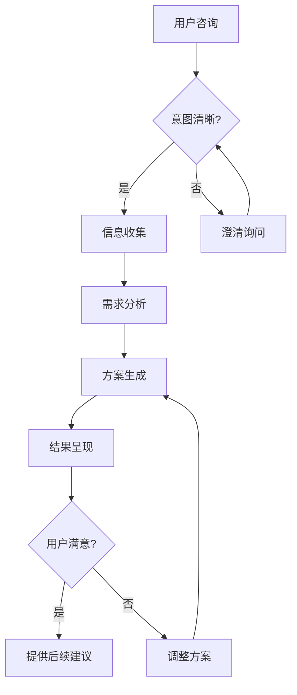
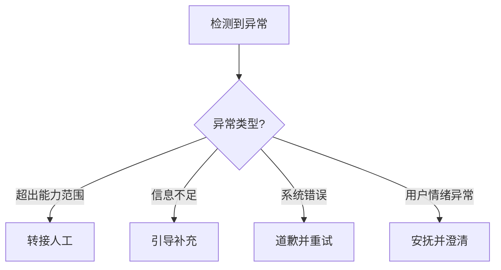

# AI Agent产品需求文档（PRD）模板

## 📋 文档信息

| 项目信息 | 内容 |
|---------|------|
| **产品名称** | [Agent产品名称] |
| **版本号** | v1.0 |
| **文档作者** | [产品经理姓名] |
| **创建日期** | [YYYY-MM-DD] |
| **最后更新** | [YYYY-MM-DD] |
| **审核状态** | [草稿/评审中/已批准] |

---

## 🎯 第一部分：Agent身份设计（Agent Persona）

### 1.1 Agent角色设定

#### 基础身份信息
- **角色名称**：[Agent的对外显示名称]
- **专业身份**：[如：资深保险规划师、AI编程助手、医疗咨询顾问]
- **服务范围**：[明确服务的业务范围和目标用户群]
- **性格特征**：[专业、耐心、友善等人格特征描述]

#### 服务目标
```
主要目标：[用一句话描述Agent要解决的核心问题]
次要目标：
- [具体目标1]
- [具体目标2] 
- [具体目标3]
```

### 1.2 能力边界声明

#### 核心能力（Can Do）
- [ ] [核心能力描述1 - 如：理解用户保险需求并给出专业分析]
- [ ] [核心能力描述2 - 如：基于用户情况推荐合适的产品]
- [ ] [核心能力描述3]
- [ ] [核心能力描述4]

#### 能力边界（Cannot Do）
- [ ] [明确不能做什么1 - 如：不能替代用户做最终购买决策]
- [ ] [明确不能做什么2 - 如：不能提供法律咨询服务]
- [ ] [明确不能做什么3]
- [ ] [明确不能做什么4]

#### 转接条件（Need Human）
- [ ] [需要转人工的情况1 - 如：复杂的争议处理]
- [ ] [需要转人工的情况2 - 如：特殊人群的专业服务]
- [ ] [需要转人工的情况3]
- [ ] [需要转人工的情况4]

---

## 🧠 第二部分：认知能力设计（Cognitive Architecture）

### 2.1 意图理解能力

#### 输入处理机制
```python
class IntentUnderstanding:
    def __init__(self):
        self.input_types = {
            "natural_language": "处理用户自然语言输入",
            "context_awareness": "结合上下文理解当前需求",
            "emotion_recognition": "识别用户情绪状态"
        }
```

#### 意图分类体系
```python
class IntentClassification:
    PRIMARY_INTENTS = {
        "[intent_1]": "[意图描述1]",
        "[intent_2]": "[意图描述2]",
        "[intent_3]": "[意图描述3]",
        "[intent_4]": "[意图描述4]"
    }
    
    SECONDARY_INTENTS = {
        "clarification_needed": "需要澄清信息",
        "information_insufficient": "信息不足需补充",
        "[custom_intent]": "[自定义次要意图]"
    }
```

### 2.2 推理决策能力

#### 推理链设计
```
用户输入 → 意图识别 → 信息收集 → 知识检索 → 方案生成 → 结果验证 → 输出表达
```

#### 决策树示例
```python
def decision_logic(user_profile):
    if user_profile.age < 30 and user_profile.status == 'single':
        return {
            "recommendation_type": "基础保障组合",
            "priority_products": ["产品A", "产品B"],
            "budget_suggestion": "年收入的X%",
            "reasoning": "决策理由说明"
        }
    elif user_profile.age >= 30 and user_profile.has_family:
        return {
            "recommendation_type": "家庭全面保障", 
            "priority_products": ["产品C", "产品D", "产品E"],
            "budget_suggestion": "年收入的Y%",
            "reasoning": "决策理由说明"
        }
```

---

## 💬 第三部分：交互行为设计（Interaction Patterns）

### 3.1 对话流程设计

#### 标准服务流程


#### 异常处理流程


### 3.2 澄清问题设计

#### 澄清问题模板库
```python
CLARIFICATION_TEMPLATES = {
    # 基础信息澄清
    "basic_info": {
        "age_inquiry": "[年龄相关澄清问题]",
        "location_inquiry": "[地理位置澄清问题]", 
        "occupation_inquiry": "[职业信息澄清问题]"
    },
    
    # 需求澄清
    "requirement_clarification": {
        "budget_range": "[预算范围澄清问题]",
        "priority_concern": "[关注重点澄清问题]",
        "timeline_inquiry": "[时间要求澄清问题]"
    },
    
    # 偏好澄清  
    "preference_clarification": {
        "feature_preference": "[功能偏好澄清问题]",
        "style_preference": "[风格偏好澄清问题]",
        "experience_inquiry": "[经验背景澄清问题]"
    }
}
```

### 3.3 响应生成策略

#### 回答结构模板
```
1. 理解确认："根据您的情况，我理解您想[复述理解的需求]"
2. 专业分析："从[领域]角度来看，[分析内容]"  
3. 具体建议："我建议您考虑[具体建议内容]"
4. 原因解释："这样建议的原因是[解释reasoning]"
5. 下一步引导："您还想了解[引导下一步对话]？"
```

#### 个性化响应策略
```python
class PersonalizedResponse:
    def generate_response(self, user_profile, query_context):
        if user_profile.expertise_level == "beginner":
            return self.generate_beginner_friendly_response(query_context)
        elif user_profile.expertise_level == "expert":
            return self.generate_technical_response(query_context)
        else:
            return self.generate_balanced_response(query_context)
```

---

## 📚 第四部分：知识体系设计（Knowledge Architecture）

### 4.1 知识图谱结构

#### 领域知识分类
```python
class KnowledgeGraph:
    def __init__(self):
        self.knowledge_categories = {
            "[类别1]": {
                "subcategories": ["子类1", "子类2", "子类3"],
                "entities": ["实体1", "实体2", "实体3"],
                "relationships": ["关系1", "关系2", "关系3"],
                "attributes": ["属性1", "属性2", "属性3"]
            },
            "[类别2]": {
                "subcategories": ["子类A", "子类B", "子类C"],
                "entities": ["实体A", "实体B", "实体C"],
                "relationships": ["关系A", "关系B", "关系C"],
                "attributes": ["属性A", "属性B", "属性C"]
            }
        }
```

#### 知识更新机制
```python
class KnowledgeUpdateSystem:
    def __init__(self):
        self.update_sources = [
            "官方数据源",
            "行业报告",
            "用户反馈",
            "专家标注"
        ]
        
    def update_workflow(self):
        """
        信息变更检测 → 影响评估 → 知识库同步 → 
        推荐逻辑调整 → A/B测试验证 → 正式发布
        """
        pass
```

### 4.2 学习反馈机制

#### 持续学习设计
```python
class ContinuousLearning:
    def update_from_feedback(self, user_feedback, conversation_context):
        if user_feedback.satisfaction < 3:
            # 分析对话中的问题点
            problem_analysis = self.analyze_conversation_issues(conversation_context)
            
            # 更新相关知识和推理逻辑
            self.update_knowledge_base(problem_analysis)
            self.adjust_reasoning_rules(problem_analysis)
            
            # 记录改进措施
            self.log_improvement_actions(problem_analysis)
```

---

## 🔧 第五部分：系统集成设计（System Integration）

### 5.1 工具调用能力

#### 可调用工具清单
```python
class AgentToolkit:
    def __init__(self):
        self.tools = {
            "[工具1名称]": Tool1Class(),     # [工具1功能描述]
            "[工具2名称]": Tool2Class(),     # [工具2功能描述]  
            "[工具3名称]": Tool3Class(),     # [工具3功能描述]
            "[工具4名称]": Tool4Class()      # [工具4功能描述]
        }
    
    def execute_tool(self, tool_name, parameters):
        """执行特定工具并处理结果"""
        try:
            result = self.tools[tool_name].execute(parameters)
            return self.format_result(result)
        except ToolExecutionError as e:
            return self.handle_tool_error(tool_name, e)
```

### 5.2 外部系统接口

#### API集成规范
```json
{
  "[api_name]": {
    "endpoint": "[API端点URL]",
    "method": "[HTTP方法]",
    "parameters": {
      "[参数1]": "[参数类型]",
      "[参数2]": "[参数类型]"
    },
    "response_format": {
      "[响应字段1]": "[字段类型]",
      "[响应字段2]": "[字段类型]"
    },
    "error_handling": {
      "timeout": "[超时处理策略]",
      "rate_limit": "[限流处理策略]",
      "service_unavailable": "[服务不可用处理策略]"
    }
  }
}
```

---

## 🧪 第六部分：测试验证设计（Testing Framework）

### 6.1 功能测试用例

#### 核心能力测试矩阵

| 测试维度 | 测试场景 | 输入示例 | 期望输出 | 成功标准 |
|----------|----------|----------|----------|----------|
| **意图理解** | 模糊需求识别 | "[模糊输入示例]" | [期望的澄清行为] | [具体成功标准] |
| **专业推理** | 复杂需求分析 | "[复杂输入示例]" | [期望的分析结果] | [具体成功标准] |
| **边界识别** | 超能力范围请求 | "[超范围输入示例]" | [期望的边界处理] | [具体成功标准] |
| **工具调用** | 工具使用场景 | "[需要工具输入]" | [期望的工具调用] | [具体成功标准] |
| **异常处理** | 异常情况处理 | "[异常输入示例]" | [期望的异常处理] | [具体成功标准] |

### 6.2 对话质量评估

#### 自动化评估指标
```python
class ConversationQualityAssessor:
    def assess_conversation(self, conversation_log):
        return {
            "intent_accuracy": self.calculate_intent_accuracy(conversation_log),
            "response_relevance": self.calculate_relevance_score(conversation_log), 
            "completion_rate": self.calculate_task_completion(conversation_log),
            "user_satisfaction": self.predict_satisfaction(conversation_log),
            "efficiency_score": self.calculate_efficiency(conversation_log)
        }
    
    def quality_thresholds(self):
        return {
            "intent_accuracy": 0.90,      # 意图识别准确率 ≥ 90%
            "response_relevance": 0.85,   # 回答相关性 ≥ 85%
            "completion_rate": 0.80,      # 任务完成率 ≥ 80%
            "user_satisfaction": 4.0,     # 用户满意度 ≥ 4.0分
            "efficiency_score": 0.75      # 效率得分 ≥ 75%
        }
```

### 6.3 用户验收测试

#### 典型用户场景测试
```markdown
### 场景1：[场景名称]
**用户背景**：[用户画像描述]
**用户输入**：[实际用户可能的输入]
**期望体验**：[用户期望得到的体验]
**成功标准**：[场景成功的具体标准]

### 场景2：[场景名称]
**用户背景**：[用户画像描述]
**用户输入**：[实际用户可能的输入]
**期望体验**：[用户期望得到的体验]
**成功标准**：[场景成功的具体标准]
```

---

## 📊 第七部分：成功指标定义（Success Metrics）

### 7.1 用户体验指标

#### 核心UX指标
```python
class UXMetrics:
    def __init__(self):
        self.core_metrics = {
            "task_success_rate": {
                "definition": "用户成功完成目标任务的比例",
                "target": "≥ 80%",
                "measurement": "成功任务数 / 总任务数"
            },
            "first_attempt_success": {
                "definition": "首次交互即成功理解需求的比例", 
                "target": "≥ 70%",
                "measurement": "首次成功数 / 总会话数"
            },
            "average_conversation_rounds": {
                "definition": "完成任务的平均对话轮次",
                "target": "≤ 5轮",
                "measurement": "总对话轮次 / 成功任务数"
            },
            "user_satisfaction_score": {
                "definition": "用户对交互体验的满意度评分",
                "target": "≥ 4.0分",
                "measurement": "5分制满意度评分的平均值"
            }
        }
```

### 7.2 技术性能指标

#### 系统性能指标
```python
class TechnicalMetrics:
    def __init__(self):
        self.performance_metrics = {
            "response_time": {
                "definition": "从用户输入到Agent回复的响应时间",
                "target": "≤ 2秒",
                "measurement": "P95响应时间统计"
            },
            "intent_recognition_accuracy": {
                "definition": "意图识别的准确率",
                "target": "≥ 90%",
                "measurement": "正确识别意图数 / 总识别次数"
            },
            "knowledge_retrieval_precision": {
                "definition": "知识检索的精准度",
                "target": "≥ 85%",
                "measurement": "相关知识检索数 / 总检索数"
            },
            "system_availability": {
                "definition": "系统正常运行时间比例",
                "target": "≥ 99.5%",
                "measurement": "正常运行时间 / 总时间"
            }
        }
```

### 7.3 业务价值指标

#### 商业影响指标
```python
class BusinessMetrics:
    def __init__(self):
        self.business_metrics = {
            "conversion_rate": {
                "definition": "从咨询到实际转化的比例",
                "target": "[根据业务设定]",
                "measurement": "转化用户数 / 总咨询用户数"
            },
            "cost_reduction": {
                "definition": "相比人工服务的成本节约",
                "target": "[根据业务设定]",
                "measurement": "节约成本 / 原人工成本"
            },
            "user_retention_rate": {
                "definition": "使用Agent服务后的用户留存率",
                "target": "[根据业务设定]", 
                "measurement": "回访用户数 / 首次使用用户数"
            },
            "nps_score": {
                "definition": "净推荐值，用户推荐意愿",
                "target": "≥ 50",
                "measurement": "NPS标准计算方法"
            }
        }
```

---

## 🚀 第八部分：实施计划（Implementation Plan）

### 8.1 开发里程碑

#### Phase 1: 基础能力建设（[时间周期]）
- [ ] [里程碑1] - [具体交付内容]
- [ ] [里程碑2] - [具体交付内容]
- [ ] [里程碑3] - [具体交付内容]

#### Phase 2: 核心功能实现（[时间周期]）
- [ ] [里程碑1] - [具体交付内容]
- [ ] [里程碑2] - [具体交付内容]
- [ ] [里程碑3] - [具体交付内容]

#### Phase 3: 优化与扩展（[时间周期]）
- [ ] [里程碑1] - [具体交付内容]
- [ ] [里程碑2] - [具体交付内容]
- [ ] [里程碑3] - [具体交付内容]

### 8.2 风险管理

#### 主要风险识别
| 风险类别 | 风险描述 | 影响程度 | 发生概率 | 应对策略 |
|---------|---------|---------|---------|---------|
| **技术风险** | [技术风险描述] | [高/中/低] | [高/中/低] | [应对措施] |
| **业务风险** | [业务风险描述] | [高/中/低] | [高/中/低] | [应对措施] |
| **用户体验风险** | [UX风险描述] | [高/中/低] | [高/中/低] | [应对措施] |
| **资源风险** | [资源风险描述] | [高/中/低] | [高/中/低] | [应对措施] |

---

## 📋 附录

### 附录A：术语表
| 术语 | 定义 |
|-----|-----|
| **Agent** | [Agent的定义] |
| **意图识别** | [意图识别的定义] |
| **知识图谱** | [知识图谱的定义] |
| **[自定义术语]** | [自定义术语的定义] |

### 附录B：参考资料
- [参考资料1]
- [参考资料2]
- [参考资料3]

### 附录C：变更历史
| 版本 | 日期 | 变更内容 | 变更人 |
|-----|------|---------|-------|
| v1.0 | [日期] | [初始版本创建] | [姓名] |
| v1.1 | [日期] | [变更内容描述] | [姓名] |

---

## 📝 使用说明

### 如何使用这个模板：

1. **复制模板**：将此模板复制到你的项目文档中
2. **替换占位符**：将所有 `[占位符内容]` 替换为实际的项目信息
3. **定制内容**：根据具体的Agent类型和业务场景调整各部分内容
4. **团队评审**：与开发团队、业务团队一起评审和完善PRD内容
5. **版本管理**：建立版本控制，跟踪PRD的变更历史

### 重点注意事项：

- **能力边界**：清晰定义Agent能做和不能做的事情是最关键的
- **测试用例**：详细的测试用例有助于开发团队理解期望的行为
- **指标定义**：明确的成功指标有助于产品迭代和优化
- **风险管理**：提前识别和规划风险应对策略

---

*此模板基于Claude Code等成功AI Agent产品的实践经验制作*  
*最后更新: 2025-08-29*  
*维护者: 产品团队*